# Maven学习总结

### 一、Maven的基本概念
> &nbsp;&nbsp;&nbsp;&nbsp;&nbsp;&nbsp;&nbsp;&nbsp;Maven是一个强大的Java<font color="red">项目构建工具</font>。

> &nbsp;&nbsp;&nbsp;&nbsp;&nbsp;&nbsp;&nbsp;&nbsp;Maven(翻译为"专家"，"内行")是跨平台的项目管理工具。主要服务于基于Java平台的项目构建，依赖管理和项目信息管理。

### **<font color="red">构建工具</font>**
 &nbsp;&nbsp;&nbsp;&nbsp;&nbsp;&nbsp;&nbsp;&nbsp;构建工具是将软件羡慕构建相关的过程自动化的工具。构建一个软件项目通常包含以下一个或多个过程：
- 生成源码（如果项目使用自动生成源码）；
- 从源码生成项目文档；
- 编译源码；
- 将编译后的代码打包成jar文件或者zip文件；
- 将打包好的代码安装到服务器、仓库或者其他的地方；


#### 1、项目构建
 &nbsp;&nbsp;&nbsp;&nbsp;&nbsp;&nbsp;&nbsp;&nbsp;项目构建的过程包括：

>  &nbsp;&nbsp;&nbsp;&nbsp;&nbsp;&nbsp;&nbsp;&nbsp;A：
清理项目
&nbsp;&nbsp;&nbsp;&nbsp;&nbsp;&nbsp;&nbsp;&nbsp;B：
编译项目
&nbsp;&nbsp;&nbsp;&nbsp;&nbsp;&nbsp;&nbsp;&nbsp;C：
测试项目
&nbsp;&nbsp;&nbsp;&nbsp;&nbsp;&nbsp;&nbsp;&nbsp;D：
生成测试报告
&nbsp;&nbsp;&nbsp;&nbsp;&nbsp;&nbsp;&nbsp;&nbsp;E：
打包项目
&nbsp;&nbsp;&nbsp;&nbsp;&nbsp;&nbsp;&nbsp;&nbsp;F：
部署项目


#### 2、依赖管理
&nbsp;&nbsp;&nbsp;&nbsp;&nbsp;&nbsp;&nbsp;&nbsp;依赖指的是jar包之间的相互依赖，比如我们搭建一个Struts2的开发框架时，光有struts2-core-2.3.16.3.jar这个jar包是不行的，struts2-core-2.3.16.3.jar还依赖其它的jar包，依赖管理指的就是使用Maven来管理项目中使用到的jar包，Maven管理的方式就是“自动下载项目所需要的jar包，统一管理jar包之间的依赖关系”。
#### 3、使用Maven的好处
&nbsp;&nbsp;&nbsp;&nbsp;&nbsp;&nbsp;&nbsp;&nbsp;A：Maven中使用约定，约定java源代码必须放在哪个目录下，编译好的java代码又必须放在哪个目录下，这些目录都有明确的规定。

&nbsp;&nbsp;&nbsp;&nbsp;&nbsp;&nbsp;&nbsp;&nbsp;B：Maven的每一个动作都拥有一个生命周期，例如执行mvn install就可以自动执行编译、测试、打包等构建过程。

&nbsp;&nbsp;&nbsp;&nbsp;&nbsp;&nbsp;&nbsp;&nbsp;C：只需要定义一个pom.xml，然后将源码放到默认的目录，Maven帮我们处理其他事情。

&nbsp;&nbsp;&nbsp;&nbsp;&nbsp;&nbsp;&nbsp;&nbsp;D：使用Maven可以进行项目高度自动化构建，依赖管理，仓库管理。

### 二、Maven下载
&nbsp;&nbsp;&nbsp;&nbsp;&nbsp;&nbsp;&nbsp;&nbsp;下载地址： http://maven.apache.org/download.cgi

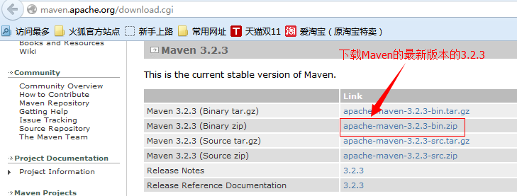
&nbsp;&nbsp;&nbsp;&nbsp;&nbsp;&nbsp;&nbsp;&nbsp;下载完成后会得到一个压缩包，解压缩压缩包后会得到如下的结构：
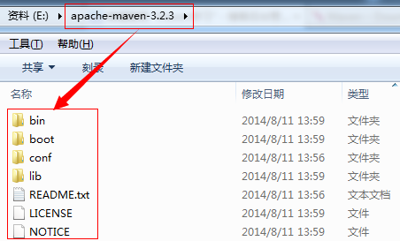

&nbsp;&nbsp;&nbsp;&nbsp;&nbsp;&nbsp;&nbsp;&nbsp;<font color="red">Maven目录分析：</font>
- <font color="red">bin:含有mvn运行的脚本</font>
- <font color="red">boot:含有plexus-classworlds类加载器框架</font>
- <font color="red">conf:含有settings.xml配置文件</font>
- <font color="red">lib:含有Maven运行时所需要的java类库</font>
- <font color="red">LICENSE.txt,NOTICE.txt,README.txt针对Maven版本，第三方软件等简要介绍</font>

### 三、Maven安装
&nbsp;&nbsp;&nbsp;&nbsp;&nbsp;&nbsp;&nbsp;&nbsp;1、首先要确保电脑上安装了JDK，配置好JDK的环境变量，使用如下的两个命令检查JDK安装的情况。
```
Echo %JAVA_HOME%
Java -version
```
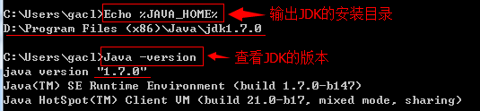
&nbsp;&nbsp;&nbsp;&nbsp;&nbsp;&nbsp;&nbsp;&nbsp;2、对apache-maven-3.2.3-bin.zip进行解压缩

&nbsp;&nbsp;&nbsp;&nbsp;&nbsp;&nbsp;&nbsp;&nbsp;对apache-maven-3.2.3-bin.zip进行解压缩，例如解压到如下目录（<font color="red">解压目录最好不要有中文</font>）
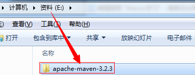
&nbsp;&nbsp;&nbsp;&nbsp;&nbsp;&nbsp;&nbsp;&nbsp;3、设置系统环境变量：MAVEN_HOME
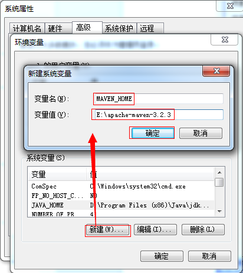
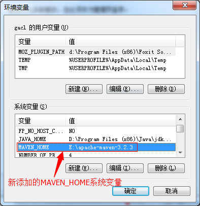
&nbsp;&nbsp;&nbsp;&nbsp;&nbsp;&nbsp;&nbsp;&nbsp;4、设置环境变量Path，将%MAVEN_HOME%\bin加入Path中，一定要注意用分号；与其他值隔开。如下图所示：

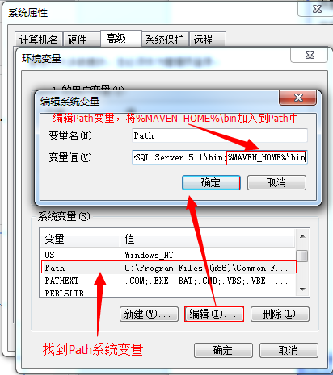
&nbsp;&nbsp;&nbsp;&nbsp;&nbsp;&nbsp;&nbsp;&nbsp;%MAVEN_HOME%\bin代表的就是"E:\apache-maven-3.2.3\bin"目录

&nbsp;&nbsp;&nbsp;&nbsp;&nbsp;&nbsp;&nbsp;&nbsp;5、验证Maven是否安装成功
&nbsp;&nbsp;&nbsp;&nbsp;&nbsp;&nbsp;&nbsp;&nbsp;打开cmd窗口
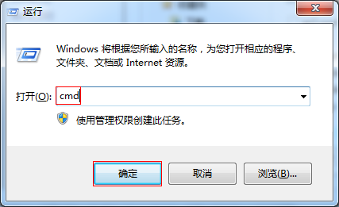
&nbsp;&nbsp;&nbsp;&nbsp;&nbsp;&nbsp;&nbsp;&nbsp;输入“mvn-v”命令，查看Maven的相关信息，如下图所示：
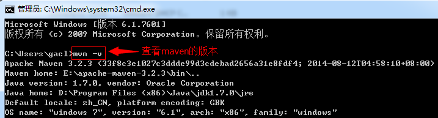

&nbsp;&nbsp;&nbsp;&nbsp;&nbsp;&nbsp;&nbsp;&nbsp;6、设置MAVEN_OPTS环境变量（可选配置）

&nbsp;&nbsp;&nbsp;&nbsp;&nbsp;&nbsp;&nbsp;&nbsp;由于Maven命令实际上是执行了Java命令，所以可以通过JAVA命令参数的方式来设置MAVEN运行参数。MAVEN_OPTS环境变量正是用于此用途

&nbsp;&nbsp;&nbsp;&nbsp;&nbsp;&nbsp;&nbsp;&nbsp;MAVEN_OPTS

&nbsp;&nbsp;&nbsp;&nbsp;&nbsp;&nbsp;&nbsp;&nbsp;-Xms128m -Xmx512m,分别设置最大
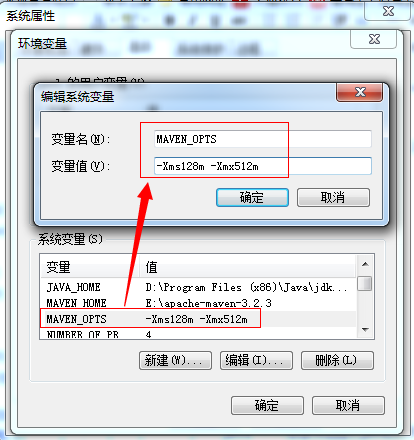

### 四：Maven的简单使用
&nbsp;&nbsp;&nbsp;&nbsp;&nbsp;&nbsp;&nbsp;&nbsp;1、Maven项目的目录约定
MavenProjectRoot（项目根目录）

&nbsp;&nbsp;&nbsp;&nbsp;&nbsp;&nbsp;&nbsp;&nbsp;|-----src

&nbsp;&nbsp;&nbsp;&nbsp;&nbsp;&nbsp;&nbsp;&nbsp;|-----|-----main

&nbsp;&nbsp;&nbsp;&nbsp;&nbsp;&nbsp;&nbsp;&nbsp;|-----|-----|-----java—— ——存放项目的.java文件

&nbsp;&nbsp;&nbsp;&nbsp;&nbsp;&nbsp;&nbsp;&nbsp;|-----|-----|-----resources—— ——存放项目资源文件，如spring，hibernate配置文档

&nbsp;&nbsp;&nbsp;&nbsp;&nbsp;&nbsp;&nbsp;&nbsp;|-----|-----test

&nbsp;&nbsp;&nbsp;&nbsp;&nbsp;&nbsp;&nbsp;&nbsp;|-----|-----|-----java—— ——存放所有测试的.java文件，如junit测试类

&nbsp;&nbsp;&nbsp;&nbsp;&nbsp;&nbsp;&nbsp;&nbsp;|-----|-----|-----resources—— ——存放项目资源文件，如spring，hibernate配置文档

&nbsp;&nbsp;&nbsp;&nbsp;&nbsp;&nbsp;&nbsp;&nbsp;|-----target—— ——项目输出位置

&nbsp;&nbsp;&nbsp;&nbsp;&nbsp;&nbsp;&nbsp;&nbsp;|-----pom.xml—— ——用于标识该项目是一个Maven项目

&nbsp;&nbsp;&nbsp;&nbsp;&nbsp;&nbsp;&nbsp;&nbsp;2、手动创建Maven项目，使用Maven编译

&nbsp;&nbsp;&nbsp;&nbsp;&nbsp;&nbsp;&nbsp;&nbsp;1、创建项目跟文件夹，例如Maven01

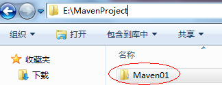

&nbsp;&nbsp;&nbsp;&nbsp;&nbsp;&nbsp;&nbsp;&nbsp;2、在Maven01文件夹中创建“pom.xml”文件，如下图所示

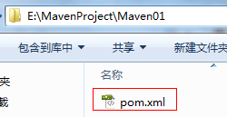

&nbsp;&nbsp;&nbsp;&nbsp;&nbsp;&nbsp;&nbsp;&nbsp;pom.xml文件中的内容如下：
```
            <?xml version="1.0" encoding="UTF-8"?>
            <project xmlns="http://maven.apache.org/POM/4.0.0"
            xmlns:xsi="http://www.w3.org/2001/XMLSchema-instance"
            xsi:schemaLocation="http://maven.apache.org/POM/4.0.0
            http://maven.apache.org/xsd/maven-4.0.0.xsd">
                <!--所有的Maven项目都必须配置这四个配置项-->
                <modelVersion>4.0.0</modelVersion>
                <!--groupId指的是项目名的项目组，默认就是包名-->
                <groupId>cn.gacl.maven.hello</groupId>
                <!--artifactId指的是项目中的某一个模块，默认命名方式是"项目名-模块名"-->
                <artifactId>hello-first</artifactId>
                <!--version指的是版本，这里使用的是Maven的快照版本-->
                <version>SNAPSHOT-0.0.1</version>
            </project>
```
&nbsp;&nbsp;&nbsp;&nbsp;&nbsp;&nbsp;&nbsp;&nbsp;3、编写Java类文件，Maven项目规定所有的*.java文件必须放在src目录下的main目录下的java目录中，在Maven01项目根目录中创建一个src目录，然后在src目录中创建main目录，在main目录下在创建java文件夹，如下图所示：

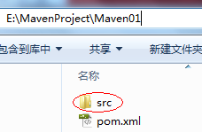
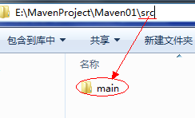
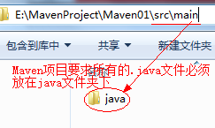

&nbsp;&nbsp;&nbsp;&nbsp;&nbsp;&nbsp;&nbsp;&nbsp;在java文件夹下创建一个Hello.java文件，如下图所示：

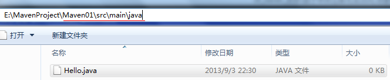

&nbsp;&nbsp;&nbsp;&nbsp;&nbsp;&nbsp;&nbsp;&nbsp;在Hello.java文件中编写如下代码：
```
    public class Hello{
      public static void main(String[] args){
        System.out.println("Hello Maven!");
      }
    }
```
&nbsp;&nbsp;&nbsp;&nbsp;&nbsp;&nbsp;&nbsp;&nbsp;4、使用Maven编译Hello.java，首先进入到项目根目录，然后使用命令”mvn compile”进行编译，如下图所示：

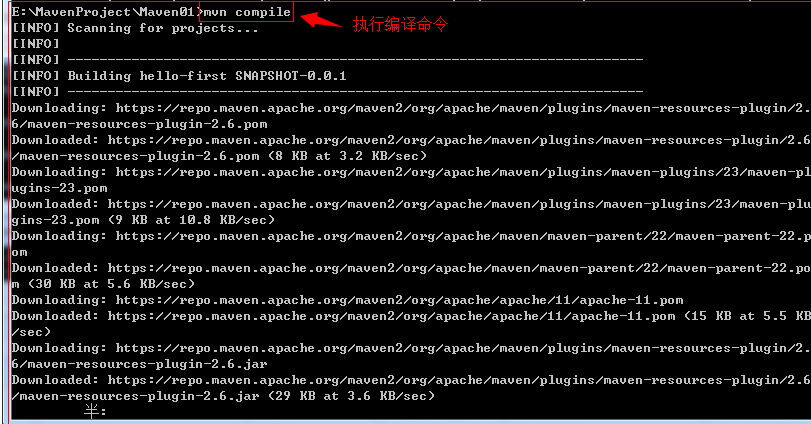

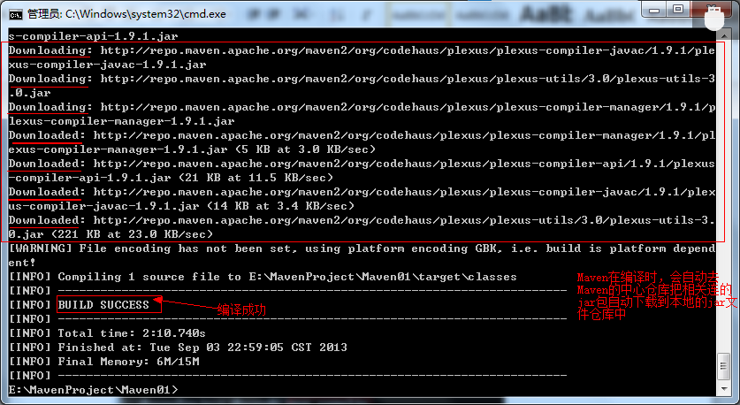

&nbsp;&nbsp;&nbsp;&nbsp;&nbsp;&nbsp;&nbsp;&nbsp;使用Maven编译完成后，在项目根目录下会生成一个target文件夹，如下图所示：

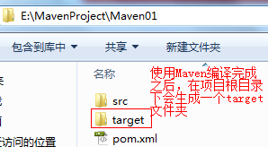

&nbsp;&nbsp;&nbsp;&nbsp;&nbsp;&nbsp;&nbsp;&nbsp;打开target文件夹，可以看到里面有一个classes文件夹，如下图所示：

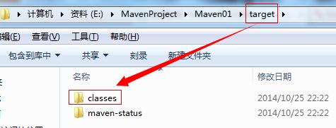

&nbsp;&nbsp;&nbsp;&nbsp;&nbsp;&nbsp;&nbsp;&nbsp;5、使用“mvn clean”命令清除编译结果，也就是把编译生成的target文件夹删掉，如下图所示：

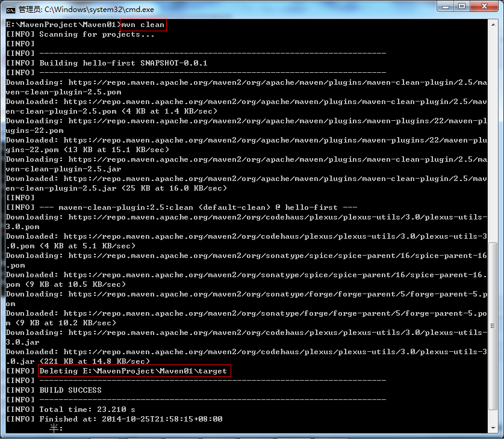

&nbsp;&nbsp;&nbsp;&nbsp;&nbsp;&nbsp;&nbsp;&nbsp;执行完"mvn -clean"命令后，target文件夹就会被删除了。
### 五、修改Maven中心仓库下载到本地的jar包的默认存储位置
&nbsp;&nbsp;&nbsp;&nbsp;&nbsp;&nbsp;&nbsp;&nbsp;从Maven中心仓库下载到本地的jar包的默认存放在“${user.home}/.m2/repository”中，${user.home}表示当前登陆系统的用户目录（如"C:\Users\gacl"），如下图所示：

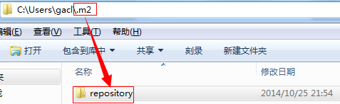

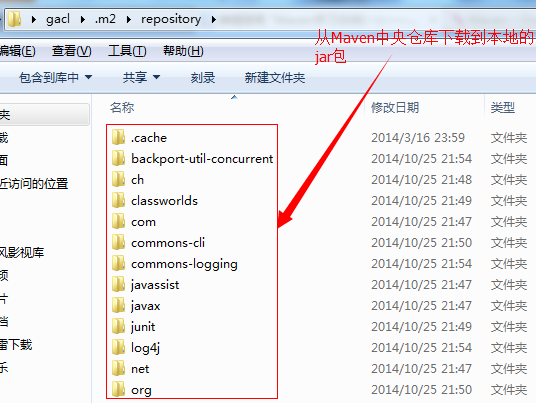

&nbsp;&nbsp;&nbsp;&nbsp;&nbsp;&nbsp;&nbsp;&nbsp;jar包存放在这个位置不太好，我们希望能跟狗自己定义下载下来的jar包的存放位置，因此我们可以自己设置下载到本地时的jar包存放目录。

&nbsp;&nbsp;&nbsp;&nbsp;&nbsp;&nbsp;&nbsp;&nbsp;在“E:\”目录下创建一个"repository"文件夹

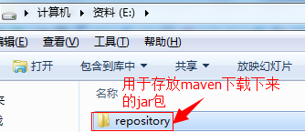

&nbsp;&nbsp;&nbsp;&nbsp;&nbsp;&nbsp;&nbsp;&nbsp;找到apache-maven-3.2.3\conf目录下的settings.xml文件，如下图所示：

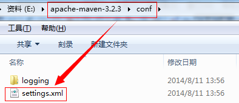

&nbsp;&nbsp;&nbsp;&nbsp;&nbsp;&nbsp;&nbsp;&nbsp;编辑setting.xml文件，如下图所示：

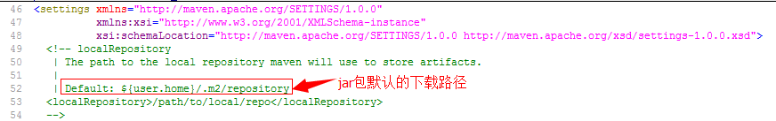

&nbsp;&nbsp;&nbsp;&nbsp;&nbsp;&nbsp;&nbsp;&nbsp;加上下面的代码：
```
  <localRepository>E:/repository</localRepository>
```
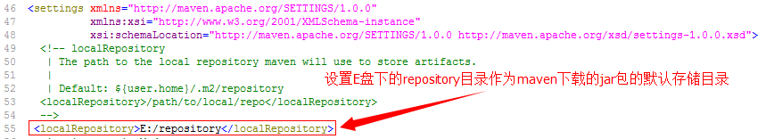

&nbsp;&nbsp;&nbsp;&nbsp;&nbsp;&nbsp;&nbsp;&nbsp;就这样可以把jar包下载到我们指定的E:/repository目录中了，如下图所示：

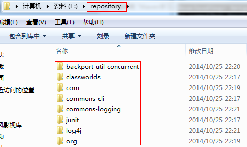

&nbsp;&nbsp;&nbsp;&nbsp;&nbsp;&nbsp;&nbsp;&nbsp;把jar包下载到本地的好处就是当编译时，会优先从本地的jar包去找，如果本地存在，就直接拿来用，如果不存在，就从Maven的中心仓库去下载。如下图所示：

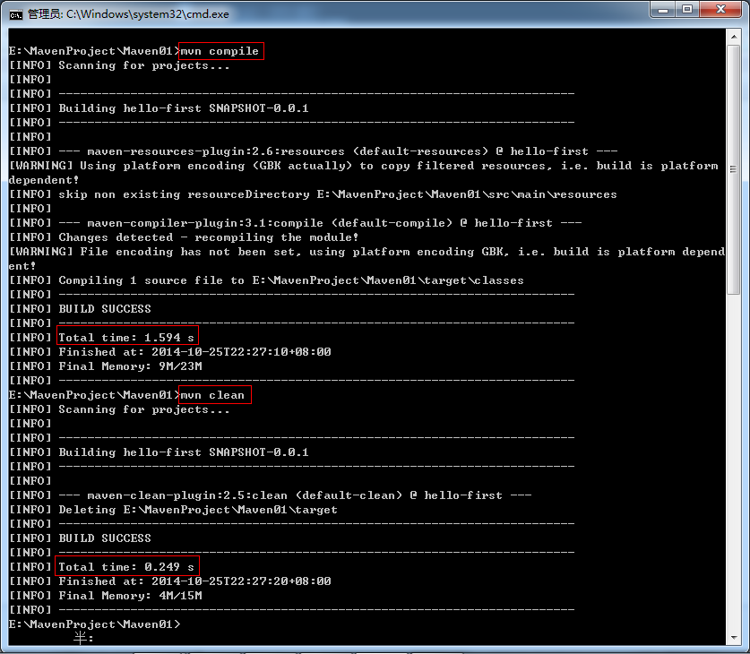

&nbsp;&nbsp;&nbsp;&nbsp;&nbsp;&nbsp;&nbsp;&nbsp;第一次执行“mvn -compile”和“mvn -clean”这两个命令时，Maven会去中央仓库下载所需的jar包，而第二次执行这两个命令时，由于所需的jar包已经在本地的仓库中存储，所以就可以直接拿来用了，这样就省去了去中央仓库下载jar包的时间。
