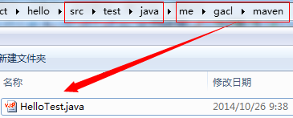

## 构建Maven项目

### 一、创建Maven项目
1、建立Hello项目

&nbsp;&nbsp;&nbsp;&nbsp;（1）首先建立Hello项目，同时建立Maven约定的目录结构和pom.xml文件

Hello

&nbsp;&nbsp;&nbsp;&nbsp;| -- src

&nbsp;&nbsp;&nbsp;&nbsp;| ----|----main

&nbsp;&nbsp;&nbsp;&nbsp;| ----|----|----java

&nbsp;&nbsp;&nbsp;&nbsp;| ----|----|----resources

&nbsp;&nbsp;&nbsp;&nbsp;| ----|----test

&nbsp;&nbsp;&nbsp;&nbsp;| ----|----|----java

&nbsp;&nbsp;&nbsp;&nbsp;| ----|----|----resources

&nbsp;&nbsp;&nbsp;&nbsp;| -- pom.xml


&nbsp;&nbsp;&nbsp;&nbsp;（2）编辑项目Hello根目录下的pom.xml,添加如下的代码：
```
              <project xmlns="http://maven.apache.org/POM/4.0.0" xmlns:xsi="http://www.w3.org/2001/XMLSchema-instance"
              xsi:schemaLocation="http://maven.apache.org/POM/4.0.0 http://maven.apache.org/xsd/maven-4.0.0.xsd">
                <modelVersion>4.0.0</modelVersion>
                <groupId>me.gacl.maven</groupId>
                <artifactId>Hello</artifactId>
                <version>0.0.1-SNAPSHOT</version>
                <name>Hello</name>

                  <!--添加依赖的jar包-->
                  <dependencies>
                      <!--项目要使用到junit的jar包，所以在这里添加junit的jar包的依赖-->
                      <dependency>
                          <groupId>junit</groupId>
                          <artifactId>junit</artifactId>
                          <version>4.9</version>
                          <scope>test</scope>
                      </dependency>        

                  </dependencies>
              </project>
```
&nbsp;&nbsp;&nbsp;&nbsp;（3）在src/main/java/me/gacl/maven目录下新建文件Hello.java


&nbsp;&nbsp;&nbsp;&nbsp;Hello.java文件的代码如下：
```
                package me.gacl.maven;
                public class Hello {                    
                    public String sayHello(String name){
                        return "Hello "+name+"!";
                    }
                }
```
&nbsp;&nbsp;&nbsp;&nbsp;（4）在/src/test/java/me/gacl/maven目录下新建测试文件HelloTest.java



&nbsp;&nbsp;&nbsp;&nbsp;HelloTest.java的代码如下：
```
            package me.gacl.maven;
            //导入junit的包
            import org.junit.Test;
            import static junit.framework.Assert.*;
            public class HelloTest {
                @Test
                public void testHello(){
                    Hello hello = new Hello();
                    String results = hello.sayHello("gacl");
                    assertEquals("Hello gacl!",results);        
                }
            }
```
2、使用Maven编译、清理、测试、打包项目
&nbsp;&nbsp;&nbsp;&nbsp;（1）使用Maven编译项目，编译项目的命令是：“mvn compile”

&nbsp;&nbsp;&nbsp;&nbsp;打开cmd命令行


&nbsp;&nbsp;&nbsp;&nbsp;进入Hello项目根目录执行“mvn compile”命令编译项目的java类


&nbsp;&nbsp;&nbsp;&nbsp;编译成功后，可以看到hello项目的根目录下多了一个【target】文件夹，这个文件夹就是编译成功之后Maven帮我们生成的文件夹，如下图所示：


&nbsp;&nbsp;&nbsp;&nbsp;打开【target】文件夹，可以看到里面有一个【classes】文件夹，如下图所示：


&nbsp;&nbsp;&nbsp;&nbsp;【classes】文件夹中存放的就是Maven编译好的java类，如下图所示：


