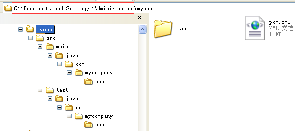
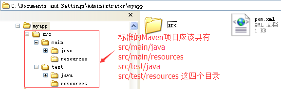
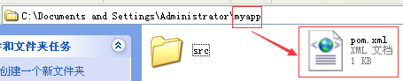
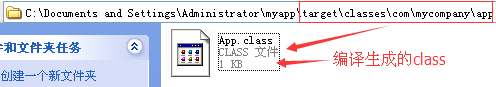

## 使用Maven构建项目

### 一、构建Java项目
1、创建Java Project

&nbsp;&nbsp;&nbsp;&nbsp;A:使用mvn archetype：generate命令，如下所示：
```
mvn archetype:generate -DroupId = com.mycompany.app
               -DartifactId = myapp
               -DarchetypeArtifactId = maven-archetype-quickstart
               -DinteractiveMode=false
```
&nbsp;&nbsp;&nbsp;&nbsp;B：使用mvn archetype:create命令，如下所示：
```
mvn archetype:create -DgroupId = com.mycompany.app
                -DartifactId = myapp
                -DarchetypeArtifactId = maven-archetype-quickstart
                -DinteractiveMode = false
```
&nbsp;&nbsp;&nbsp;&nbsp;<font color='red' weight='bold'>generate和create的区别：</font>generate创建项目耗时长，create创建项目耗时短。

&nbsp;&nbsp;&nbsp;&nbsp;使用mvn archetype:create命令创建项目的过程如下所示：


&nbsp;&nbsp;&nbsp;&nbsp;BUILD SUCCESS就表示项目构建成功，在当前用户目录下（即C:\Documents and Settings\Administrator）下构建了一个Java Project叫做myapp。

&nbsp;&nbsp;&nbsp;&nbsp;构建好的Java项目的目录结构如下：


&nbsp;&nbsp;&nbsp;&nbsp;Maven创建的是一个标准的Maven项目，不过目前Maven只是生成了src/main/java(存放项目的源代码)和src/test/java(存放测试源代码)这两个目录，但在实际项目中还会有配置文件，如log4j.properties,所以还需手动创建src/main/resources(存放项目开发中用到的配置文件，如存放log4j.properties等)和src/test/resources(存放测试时用到的配置文件)，如下图所示：


&nbsp;&nbsp;&nbsp;&nbsp;然后将创建好的myapp项目导入到eclipse中进行开发，如下图所示：


### 二：项目中的POM.xml文件的说明

&nbsp;&nbsp;&nbsp;&nbsp;通过Maven构建的JavaProject，在项目的根目录下会存在一个pom.xml文件，进入myapp目录可以看到一个pom.xml文件，这个文件是Maven的核心，如下图所知：


&nbsp;&nbsp;&nbsp;&nbsp;A：pom的意思是：project object model;

&nbsp;&nbsp;&nbsp;&nbsp;B：pom.xml文件包含了项目的信息和项目的依赖等；

&nbsp;&nbsp;&nbsp;&nbsp;C：pom.xml文件是可以继承的，大型项目中，子模快的pom.xml一般都会继承于父模块的pom.xml

pom.xml文件的内容如下：
```
<project xmlns="http://maven.apache.org/POM/4.0.0" xmlns:xsi="http://www.w3.org/2001/XMLSchema-instance"
  xsi:schemaLocation="http://maven.apache.org/POM/4.0.0 http://maven.apache.org/xsd/maven-4.0.0.xsd">
  <modelVersion>4.0.0</modelVersion>

  <groupId>com.mycompany.app</groupId>
  <artifactId>myapp</artifactId>
  <version>1.0-SNAPSHOT</version>
  <packaging>jar</packaging>

  <name>myapp</name>
  <url>http://maven.apache.org</url>

  <properties>
    <project.build.sourceEncoding>UTF-8</project.build.sourceEncoding>
  </properties>

  <dependencies>
    <dependency>
      <groupId>junit</groupId>
      <artifactId>junit</artifactId>
      <version>3.8.1</version>
      <scope>test</scope>
    </dependency>
  </dependencies>
</project>
```

pom文件的详细解析：

> <font color='blue'><</font><font color='red'>project</font><font color='blue'>></font>&nbsp;&nbsp;&nbsp;&nbsp;pom文件的顶级节点

> <font color='blue'><</font><font color='red'>modelVersion</font><font color='blue'>></font>&nbsp;&nbsp;&nbsp;&nbsp;object model版本，对Maven2和Maven3来说，只能是4.0.0


> <font color='blue'><</font><font color='red'>groupId</font><font color='blue'>></font>&nbsp;&nbsp;&nbsp;&nbsp;项目创建组织的标识，一般是域名的倒写

> <font color='blue'><</font><font color='red'>artifactId</font><font color='blue'>></font>&nbsp;&nbsp;&nbsp;&nbsp;定义了项目所在组织的标识符下的唯一标识，一个组织下可以有多个项目

> <font color='blue'><</font><font color='red'>version</font><font color='blue'>></font>&nbsp;&nbsp;&nbsp;&nbsp;version当前项目的版本，SNAPSHOT，在开发中，表示快照版本

> <font color='blue'><</font><font color='red'>packaging</font><font color='blue'>></font>&nbsp;&nbsp;&nbsp;&nbsp;打包的方式：有jar、war、ear等

> <font color='blue'><</font><font color='red'>name</font><font color='blue'>></font>&nbsp;&nbsp;&nbsp;&nbsp;项目的名称
> <font color='blue'><</font><font color='red'>url</font><font color='blue'>></font>&nbsp;&nbsp;&nbsp;&nbsp;项目的地址

> <font color='blue'><</font><font color='red'>properties</font><font color='blue'>></font>&nbsp;&nbsp;&nbsp;&nbsp;属性配置

> <font color='blue'><</font><font color='red'>dependencies</font><font color='blue'>></font>&nbsp;&nbsp;&nbsp;&nbsp;构建项目依赖的jar


<font color='red' font-weight='bold'>有groupId、artifactId和version唯一的确定了一个项目坐标</font>


### 三：使用Maven编译-测试-打包-安装项目
&nbsp;&nbsp;&nbsp;&nbsp;A：编译
> &nbsp;&nbsp;&nbsp;&nbsp;编译源程序，进入命令行，切换到myapp目录，执行命令：mvn clean compile,如下图所示：

&nbsp;&nbsp;&nbsp;&nbsp;编译成功，在myapp目录下多出一个target目录，target\classes里面存放的就是编译后的class文件，如下图所示：


&nbsp;&nbsp;&nbsp;&nbsp;B：测试
> &nbsp;&nbsp;&nbsp;&nbsp;进入命令行，切换到myapp目录，执行命令：mvn clean test,如下图所示：

&nbsp;&nbsp;&nbsp;&nbsp;测试成功，在myapp\target目录下会有一个test-classes目录，存放的就是测试代码的class文件，如下图所示：

