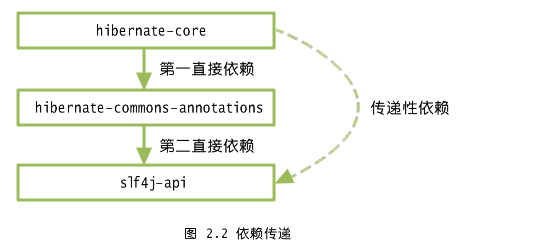
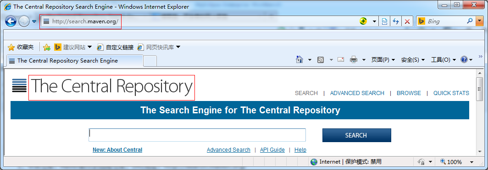
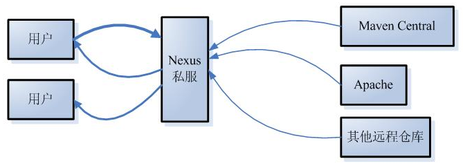

## Maven核心概念
### 一、Maven坐标
#### 1、什么是坐标？

> 在平面几何中坐标（x,y）可以标识平面中唯一的一个点。

#### 2、Maven坐标主要组成
- groupId：&nbsp;&nbsp;&nbsp;&nbsp;组织标识（包名）
- artifactId：&nbsp;&nbsp;&nbsp;&nbsp;项目名称
- version：&nbsp;&nbsp;&nbsp;&nbsp;项目的当前版本
- packaging：&nbsp;&nbsp;&nbsp;&nbsp;项目的打包方式，最为常见的是<font color='red'><b>jar</b></font>和<font color='red'><b>war</b></font>

> &nbsp;&nbsp;&nbsp;&nbsp;<font color='red'><b>样例：</b></font>

```
      <groupId>com.mycompany.app</groupId>
      <artifactId>myapp</artifactId>
      <version>1.0-SNAPSHOT</version>
      <packaging>jar</packaging>
```
```
      <groupId>com.mycompany.app</groupId>
      <artifactId>myWebApp</artifactId>
      <packaging>war</packaging>
      <version>1.0-SNAPSHOT</version>
```

#### 3、Maven为什么使用坐标？

> &nbsp;&nbsp;&nbsp;&nbsp;Maven拥有大量的构建，需要找一个用来唯一标识一个构建的同意规范

> &nbsp;&nbsp;&nbsp;&nbsp;拥有了统一的规范，就可以把查找工作交给机器

### 二、依赖管理
#### 1、依赖配置

> 依赖配置主要包含如下元素：

```
<!--添加依赖配置-->
    <dependencies>
        <!--项目要使用到junit的jar包，所以在这里添加junit的jar包的依赖-->
        <dependency>
            <groupId>junit</groupId>
            <artifactId>junit</artifactId>
            <version>4.9</version>
            <scope>test</scope>
        </dependency>
        <!--项目要使用到Hello的jar包，所以在这里添加Hello的jar包的依赖-->
        <dependency>
            <groupId>me.gacl.maven</groupId>
            <artifactId>Hello</artifactId>
            <version>0.0.1-SNAPSHOT</version>
            <scope>compile</scope>
        </dependency>    
    </dependencies>
```

```
<dependencies>
    <dependency>
        <groupId>org.springframework</groupId>
        <artifactId>spring-test</artifactId>
        <version>3.2.0.RELEASE</version>
        <type>jar</type>
        <scope>test</scope>
        <systemPath>${java.home}/lib/rt.jar</systemPath>
        <optional>false</optional>
        <exclusions>
            <exclusion></exclusion>
        </exclusions>
    </dependency>
</dependencies>
```
> <font color='blue'><b>配置详解：</b></font>

- <font color='blue'><b>type:</b></font>依赖类型，对应构件中定义的packaging，可不声明，默认为jar；
- <font color='blue'><b>scope：</b></font>依赖范围；
- <font color='blue'><b>optional：</b></font>依赖是否可选；
- <font color='blue'><b>exclusions：</b></font>排除传递依赖。

#### 2、依赖范围
> <font color='red'><b>依赖范围scope用来控制依赖、编译和测试，运行的classpath的关系：执行不同的Maven命令（mvn package,mvn test,mvn install....）,会使用不同的classpath，Maven对应的有三套classpath：编译classpath、测试classpath、运行classpath。scope选项的值，决定了该依赖构件会被引入到哪一个classpath中。</b></font>

> - 1、<font color='yellow'><b>compile:</b></font>默认依赖编译范围。对于编译、测试、运行三种classpath都有效。

> - 2、<font color='yellow'><b>test:</b></font>测试依赖范围。只对于测试classpath有效。

> - 3、<font color='yellow'><b>provided:</b></font>已提供依赖范围。对于编译、测试的classpath都有效，但对于运行无效。因为容器已提供，例如servlet-api。

> - 4、<font color='yellow'><b>runtime:</b></font>运行时提供。例如jdbc驱动。

> - 5、<font color='yellow'><b>system:</b></font>系统依赖范围。和provided依赖范围一致，需要通过<systemPath>显示指定，且可以引用环境变量。

> - 6、<font color='yellow'><b>import:</b></font>导入依赖范围。使用该选项，通常需要<type>pom</type>，将目标pom的dependencyManagement配置导入合并到当前pom的dependencyManagement元素。

#### 3、传递性依赖


MakeFriends.jar直接依赖于HelloFriends.jar，而HelloFriends.jar又直接依赖于Hello.jar，那么MakeFriends.jar也依赖于Hello.jar,这就是传递性依赖，只不过这种依赖是间接依赖，如上图所示。



如上图所示，hibernate-core 依赖 hibernate-commons-annotations ，而 hibernate-commons-annotations 又依赖 slf4j-api ，hibernate-core 对 slf4j-api 的依赖就是传递依赖。我们只需要引入 hibernate-core 构件的依赖，不用考虑它还有其它的依赖， 也不用担心会引入多余或冲突的依赖，Maven 会自动为我们引入依赖及传递依赖。

#### 4、依赖传递和依赖范围
如上所述，几种依赖关系分别叫做第一直接依赖，第二直接依赖和传递性依赖，其中第一直接依赖和第二直接依赖的依赖范围，决定了传递性依赖的依赖范围。


#### 5、依赖冲突

通常不需要关心传递性依赖，当多个传递性依赖中有对同一构件不同版本的依赖时，如何解决？

-  <font color='red'><b>短路径优先：</b></font>假如有以下依赖：A-->B-->--C-->X(版本1.0)和A-->-->D-->X(版本2.0)，则优先解析较短路径的X（版本2.0）；
-  <font color='red'><b>先声明优先：</b></font>若路径长度相同，则谁先声明，谁先被解析。

#### 6、依赖排除

> 针对依赖冲突中的“短路径优先”，如果我们想使用长路径的依赖如何解决呢？

> 这时可以使用依赖排除<exclusions>元素，显示排除短路径依赖。在非冲突的情况下，这种方法同样有效。

#### 7、依赖归类

> 通常在项目中，我们会同时依赖同一个构件的不同模块，如Spring-orm-3.2.0，spring-context-3.2.0，且多个模块版本相同，为了维护和升级方便，我们可以对其进行统一管理，这时可以使用到Maven属性，类似变量的含义。

```
<properties>
    <springframework.version>3.2.0.RELEASE</springframework.version>
</properties>

<dependencies>
    <dependency>
        <groupId>org.springframework</groupId>
        <artifactId>spring-orm</artifactId>
        <version>${springframework.version}</version>
    </dependency>
    <dependency>
        <groupId>org.springframework</groupId>
        <artifactId>spring-context</artifactId>
        <version>${springframework.version}</version>
    </dependency>
</dependencies>
```

### 三：仓库管理
#### 1、Maven仓库
> 用来统一存储所有Maven共享构建的位置就是仓库。

#### 2、Maven仓库的布局
> 根据Maven坐标定义每个构建在仓库中的唯一存储路径，大致为：groupId/artifactId/version/artifactId-version.packaging

#### 3、仓库的分类
> - A：本地仓库

&nbsp;&nbsp;&nbsp;&nbsp;&nbsp;&nbsp;&nbsp;&nbsp;每个用户只有一个本地仓库，默认是在~/.m2/repository/,~代表的是用户目录
> - B：远程仓库

> > * （1）中央仓库：Maven默认的远程仓库，URL地址：http://search.maven.org/

> > 

> > * （2）私服

> > 

### 四：生命周期

#### 1、何为生命周期？
> Maven的生命周期就是为了对所有的构建过程进行抽象和统一，包括项目清理，初始化，打包，测试，部署等几乎所有的构建步骤。

### 2、Maven的三大生命周期

> Maven有三套相互独立的生命周期，这三套生命周期分别是：

> > * Clean Lifecyle 在进行真正的构建之前进行一些清理工作。
> > * Default Lifecycle 构建的核心部分，编译，测试，打包，部署等等。
> > * Site Lifecycle 生成项目报告，站点，发布站点。

> Clean 生命周期
> > Clean生命周期共包含了三个阶段

> > * pre-clean 执行一些需要在clean之前完成的工作。
> > * clean 移除所有上一次构建生成的文件。
> > * post-clean 执行一些需要在clean之后立刻完成的工作。

 <font color="red">mvn clean中的clean就是上面的clean，在一个生生命周期中，运行某个阶段的时候，它之前的所有阶段都会被运行，也就是说，“mvn clean”等同于mvn pre-clean clean,如果我们运行mvn post-clean，那么pre-clean，clean都会被运行，这是maven很重要的一个规则，可以大大简化命令行的输入。</font>

> Site生命周期
> > pre-site执行一些需要在生成站点文档之前完成的工作
> > * Site生成项目的站点文档。
> > * post-site执行一些需要在生成站点文档之后完成的工作，并且为部署做准备。
> > * site-deploy 将生成的站点文档部署到特定的服务器上。

<font color="red">这里经常用到的是site阶段和site-deploy阶段，用以生成和发布Maven站点，这是Maven强大的功能。</font>

> Default 生命周期
> > Default生命周期市Maven生命周期中最重要的一个，绝大部分工作都发生在这个生命周期中。

> > * validate
> > * generate-sources
> > * process-sources
> > * generate-resources
> > * process-resources 复制并处理资源文件，至目标目录，准备打包。
> > * compile 编译项目的源代码
> > * process-classes
> > * generate-test-sources
> > * process-test-sources
> > * generate-test-resources
> > * process-test-resources 复制并处理资源文件，至目标测试目录。
> > * test-compile 编译测试源代码。
process-test-classes
test 使用合适的单元测试框架运行测试，这些测试代码不会被打包部署
prepare-package
package 接受编译好的代码，打包成克发布的格式，如JAR。
pre-integratiom-test
integration-test
post-integratioon-test
verify
install 将包安装至本地仓库，以让其他项目依赖。
deploy 将最终的包复制到远程的仓库，以让其他的开发人员和项目共享。

<font color="red">运行任何一个阶段的时候，它前面的所有阶段都会被运行，这也是为什么运行mvn install的时候，代码会被编译，测试，打包。此外，Maven的插件机制是完全依赖Maven的生命周期的，因此理解生命周期至关重要。</font>

### 五：Maven插件
> #### 1、Maven的核心仅仅定义了抽象的生命周期，具体的任务都是交由插件完成的。
> #### 2、每个插件都能实现多个功能，每个功能就是一个插件目标。
> #### 3、Maven的生命周期与插件目标相互绑定，以完成某个具体的构建任务，例如compile就是maven-compiler-plugin的一个插件目标。

<font color="red" font-weight="bold">Maven常用插件：</font>

调用Maven插件的两种方式：
> <font color="yellow">方式一：</font>将插件目标与生命周期阶段（lifecycle phase）绑定，这样用户在命令行只是输入生命周期阶段而已，例如Maven默认将maven-compiler-plugin的compile目标与compile生命周期阶段绑定，因此命令mvn compile实际上是先定位到compile这一生命周期阶段，然后在根据绑定关系调用maven-compiler-plugin的compile目标。


> <font color="yellow">方式二：</font>直接在命令行指定要执行的插件目标，例如mvn archetype:generate就表示调用maven-archetype-plugin的generate目标，这种带冒号的调用方式与生命周期无关。

* maven-antrun-plugin(http://maven.apache.org/plugins/maven-antrun-plugin/)
> maven-antrun-plugin能让用户在Maven中运行Ant任务。用户可以直接在改插件中配置以Ant的方式编写Target，然后交给插件的run目标去执行。在一些由Ant往Maven迁移的项目中，该插件尤其有用。此外，当你发现需要编写一些自定义程度很高的任务，同时又觉得Maven不够灵活，也可以以Ant的方式实现。maven-antrun-plugin目标通常与生命周期绑定运行。

* maven-archetype-plugin(http://maven.apache.org/archetype/maven-archetype-plugin/)
> Archetype指项目的骨架，Maven初学者最开始执行的Maven命令可能就是mvn archetype:generate，这实际上就是让maven-archetype-plugin生成一个很简单的项目骨架，帮助开发者快速上手。可能也有人看到一些文档写了mvn archetype:create， 但实际上create目标已经被弃用了，取而代之的是generate目标，该目标使用交互式的方式提示用户输入必要的信息以创建项目，体验更好。 maven-archetype-plugin还有一些其他目标帮助用户自己定义项目原型，例如你由一个产品需要交付给很多客户进行二次开发，你就可以为 他们提供一个Archtype，帮助他们快速上手。

* maven-assembly-plugin（http://maven.apache.org/plugins/maven-assembly-plugin/）
> maven-assembly-plugin的用途是制作项目分发包，该分发包可能包含了项目的可执行文件、源代码、readme、平台脚本等等。 maven-assembly-plugin支持各种主流的格式如zip、tar.gz、jar和war等，具体打包哪些文件是高度可控的，例如用户可以 按文件级别的粒度、文件集级别的粒度、模块级别的粒度、以及依赖级别的粒度控制打包，此外，包含和排除配置也是支持的。maven-assembly- plugin要求用户使用一个名为assembly.xml的元数据文件来表述打包，它的single目标可以直接在命令行调用，也可以被绑定至生命周期。
* maven-dependency-plugin（http://maven.apache.org/plugins/maven-dependency-plugin/）
> maven-dependency-plugin最大的用途是帮助分析项目依赖，dependency:list能够列出项目最终解析到的依赖列表，dependency:tree能进一步的描绘项目依赖树，dependency:analyze可以告诉你项目依赖潜在的问题，如果你有直接使用到的却未声明的依赖，该目标就会发出警告。maven-dependency-plugin还有很多目标帮助你操作依赖文件，例如dependency:copy-dependencies能将项目依赖从本地Maven仓库复制到某个特定的文件夹下面。
* maven-enforcer-plugin(http://maven.apache.org/plugins/maven-enforcer-plugin/)
> 在一个稍大一点的组织或团队中，你无法保证所有成员都熟悉Maven，那他们做一些比较愚蠢的事情就会变得很正常，例如给项目引入了外部的 SNAPSHOT依赖而导致构建不稳定，使用了一个与大家不一致的Maven版本而经常抱怨构建出现诡异问题。maven-enforcer- plugin能够帮助你避免之类问题，它允许你创建一系列规则强制大家遵守，包括设定Java版本、设定Maven版本、禁止某些依赖、禁止 SNAPSHOT依赖。只要在一个父POM配置规则，然后让大家继承，当规则遭到破坏的时候，Maven就会报错。除了标准的规则之外，你还可以扩展该插 件，编写自己的规则。maven-enforcer-plugin的enforce目标负责检查规则，它默认绑定到生命周期的validate阶段。
* maven-help-plugin(http://maven.apache.org/plugins/maven-help-plugin/)
> maven-help-plugin是一个小巧的辅助工具，最简单的help:system可以打印所有可用的环境变量和Java系统属性。help:effective-pom和help:effective-settings最 为有用，它们分别打印项目的有效POM和有效settings，有效POM是指合并了所有父POM（包括Super POM）后的XML，当你不确定POM的某些信息从何而来时，就可以查看有效POM。有效settings同理，特别是当你发现自己配置的 settings.xml没有生效时，就可以用help:effective-settings来验证。此外，maven-help-plugin的describe目标可以帮助你描述任何一个Maven插件的信息，还有all-profiles目标和active-profiles目标帮助查看项目的Profile。
* maven-release-plugin(http://maven.apache.org/plugins/maven-release-plugin/)
> maven-release-plugin的用途是帮助自动化项目版本发布，它依赖于POM中的SCM信息。release:prepare用来准备版本发布，具体的工作包括检查是否有未提交代码、检查是否有SNAPSHOT依赖、升级项目的SNAPSHOT版本至RELEASE版本、为项目打标签等等。release:perform则 是签出标签中的RELEASE源码，构建并发布。版本发布是非常琐碎的工作，它涉及了各种检查，而且由于该工作仅仅是偶尔需要，因此手动操作很容易遗漏一 些细节，maven-release-plugin让该工作变得非常快速简便，不易出错。maven-release-plugin的各种目标通常直接在 命令行调用，因为版本发布显然不是日常构建生命周期的一部分。
* maven-resources-plugin(http://maven.apache.org/plugins/maven-resources-plugin/)
> 为了使项目结构更为清晰，Maven区别对待Java代码文件和资源文件，maven-compiler-plugin用来编译Java代码，maven-resources-plugin则用来处理资源文件。默认的主资源文件目录是src/main/resources，很多用户会需要添加额外的资源文件目录，这个时候就可以通过配置maven-resources-plugin来实现。此外，资源文件过滤也是Maven的一大特性，你可以在资源文件中使用${propertyName}形式的Maven属性，然后配置maven-resources-plugin开启对资源文件的过滤，之后就可以针对不同环境通过命令行或者Profile传入属性的值，以实现更为灵活的构建。
* maven-surefire-plugin(http://maven.apache.org/plugins/maven-surefire-plugin/)
> 可能是由于历史的原因，Maven 2/3中用于执行测试的插件不是maven-test-plugin，而是maven-surefire-plugin。其实大部分时间内，只要你的测试 类遵循通用的命令约定（以Test结尾、以TestCase结尾、或者以Test开头），就几乎不用知晓该插件的存在。然而在当你想要跳过测试、排除某些 测试类、或者使用一些TestNG特性的时候，了解maven-surefire-plugin的一些配置选项就很有用了。例如 mvn test -Dtest=FooTest 这样一条命令的效果是仅运行FooTest测试类，这是通过控制maven-surefire-plugin的test参数实现的。
* build-helper-maven-plugin(http://mojo.codehaus.org/build-helper-maven-plugin/)
> Maven默认只允许指定一个主Java代码目录和一个测试Java代码目录，虽然这其实是个应当尽量遵守的约定，但偶尔你还是会希望能够指定多个 源码目录（例如为了应对遗留项目）build-helper-maven-plugin的add-source目标就是服务于这个目的，通常它被绑定到 默认生命周期的generate-sources阶段以添加额外的源码目录。需要强调的是，这种做法还是不推荐的，因为它破坏了 Maven的约定，而且可能会遇到其他严格遵守约定的插件工具无法正确识别额外的源码目录。
> build-helper-maven-plugin的另一个非常有用的目标是attach-artifact，使用该目标你可以以classifier的形式选取部分项目文件生成附属构件，并同时install到本地仓库，也可以deploy到远程仓库。
* exec-maven-plugin(http://mojo.codehaus.org/exec-maven-plugin/)
> exec-maven-plugin很好理解，顾名思义，它能让你运行任何本地的系统程序，在某些特定情况下，运行一个Maven外部的程序可能就是最简单的问题解决方案，这就是exec:exec的 用途，当然，该插件还允许你配置相关的程序运行参数。除了exec目标之外，exec-maven-plugin还提供了一个java目标，该目标要求你 提供一个mainClass参数，然后它能够利用当前项目的依赖作为classpath，在同一个JVM中运行该mainClass。有时候，为了简单的 演示一个命令行Java程序，你可以在POM中配置好exec-maven-plugin的相关运行参数，然后直接在命令运行 mvn exec:java 以查看运行效果。
* jetty-maven-plugin(http://wiki.eclipse.org/Jetty/Feature/Jetty_Maven_Plugin)
>在进行Web开发的时候，打开浏览器对应用进行手动的测试几乎是无法避免的，这种测试方法通常就是将项目打包成war文件，然后部署到Web容器 中，再启动容器进行验证，这显然十分耗时。为了帮助开发者节省时间，jetty-maven-plugin应运而生，它完全兼容 Maven项目的目录结构，能够周期性地检查源文件，一旦发现变更后自动更新到内置的Jetty Web容器中。做一些基本配置后（例如Web应用的contextPath和自动扫描变更的时间间隔），你只要执行 mvn jetty:run ，然后在IDE中修改代码，代码经IDE自动编译后产生变更，再由jetty-maven-plugin侦测到后更新至Jetty容器，这时你就可以直接 测试Web页面了。需要注意的是，jetty-maven-plugin并不是宿主于Apache或Codehaus的官方插件，因此使用的时候需要额外 的配置settings.xml的pluginGroups元素，将org.mortbay.jetty这个pluginGroup加入。
* versions-maven-plugin(http://mojo.codehaus.org/versions-maven-plugin/)
> 很多Maven用户遇到过这样一个问题，当项目包含大量模块的时候，为他们集体更新版本就变成一件烦人的事情，到底有没有自动化工具能帮助完成这件 事情呢？（当然你可以使用sed之类的文本操作工具，不过不在本文讨论范围）答案是肯定的，versions-maven- plugin提供了很多目标帮助你管理Maven项目的各种版本信息。例如最常用的，命令 mvn versions:set -DnewVersion=1.1-SNAPSHOT 就能帮助你把所有模块的版本更新到1.1-SNAPSHOT。该插件还提供了其他一些很有用的目标，display-dependency- updates能告诉你项目依赖有哪些可用的更新；类似的display-plugin-updates能告诉你可用的插件更新；然后use- latest-versions能自动帮你将所有依赖升级到最新版本。最后，如果你对所做的更改满意，则可以使用 mvn versions:commit 提交，不满意的话也可以使用 mvn versions:revert 进行撤销。
