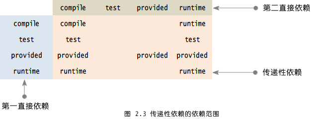

## Maven核心概念
### 一、Maven坐标
#### 1、什么是坐标？

> 在平面几何中坐标（x,y）可以标识平面中唯一的一个点。

#### 2、Maven坐标主要组成
- groupId：&nbsp;&nbsp;&nbsp;&nbsp;组织标识（包名）
- artifactId：&nbsp;&nbsp;&nbsp;&nbsp;项目名称
- version：&nbsp;&nbsp;&nbsp;&nbsp;项目的当前版本
- packaging：&nbsp;&nbsp;&nbsp;&nbsp;项目的打包方式，最为常见的是<font color='red'><b>jar</b></font>和<font color='red'><b>war</b></font>

> &nbsp;&nbsp;&nbsp;&nbsp;<font color='red'><b>样例：</b></font>

```
      <groupId>com.mycompany.app</groupId>
      <artifactId>myapp</artifactId>
      <version>1.0-SNAPSHOT</version>
      <packaging>jar</packaging>
```
```
      <groupId>com.mycompany.app</groupId>
      <artifactId>myWebApp</artifactId>
      <packaging>war</packaging>
      <version>1.0-SNAPSHOT</version>
```

#### 3、Maven为什么使用坐标？

> &nbsp;&nbsp;&nbsp;&nbsp;Maven拥有大量的构建，需要找一个用来唯一标识一个构建的同意规范

> &nbsp;&nbsp;&nbsp;&nbsp;拥有了统一的规范，就可以把查找工作交给机器

### 二、依赖管理
#### 1、依赖配置

> 依赖配置主要包含如下元素：

```
<!--添加依赖配置-->
    <dependencies>
        <!--项目要使用到junit的jar包，所以在这里添加junit的jar包的依赖-->
        <dependency>
            <groupId>junit</groupId>
            <artifactId>junit</artifactId>
            <version>4.9</version>
            <scope>test</scope>
        </dependency>
        <!--项目要使用到Hello的jar包，所以在这里添加Hello的jar包的依赖-->
        <dependency>
            <groupId>me.gacl.maven</groupId>
            <artifactId>Hello</artifactId>
            <version>0.0.1-SNAPSHOT</version>
            <scope>compile</scope>
        </dependency>    
    </dependencies>
```

```
<dependencies>
    <dependency>
        <groupId>org.springframework</groupId>
        <artifactId>spring-test</artifactId>
        <version>3.2.0.RELEASE</version>
        <type>jar</type>
        <scope>test</scope>
        <systemPath>${java.home}/lib/rt.jar</systemPath>
        <optional>false</optional>
        <exclusions>
            <exclusion></exclusion>
        </exclusions>
    </dependency>
</dependencies>
```
> <font color='blue'><b>配置详解：</b></font>

- <font color='blue'><b>type:</b></font>依赖类型，对应构件中定义的packaging，可不声明，默认为jar；
- <font color='blue'><b>scope：</b></font>依赖范围；
- <font color='blue'><b>optional：</b></font>依赖是否可选；
- <font color='blue'><b>exclusions：</b></font>排除传递依赖。

#### 2、依赖范围
> <font color='red'><b>依赖范围scope用来控制依赖、编译和测试，运行的classpath的关系：执行不同的Maven命令（mvn package,mvn test,mvn install....）,会使用不同的classpath，Maven对应的有三套classpath：编译classpath、测试classpath、运行classpath。scope选项的值，决定了该依赖构件会被引入到哪一个classpath中。</b></font>

> - 1、<font color='yellow'><b>compile:</b></font>默认依赖编译范围。对于编译、测试、运行三种classpath都有效。

> - 2、<font color='yellow'><b>test:</b></font>测试依赖范围。只对于测试classpath有效。

> - 3、<font color='yellow'><b>provided:</b></font>已提供依赖范围。对于编译、测试的classpath都有效，但对于运行无效。因为容器已提供，例如servlet-api。

> - 4、<font color='yellow'><b>runtime:</b></font>运行时提供。例如jdbc驱动。

> - 5、<font color='yellow'><b>system:</b></font>系统依赖范围。和provided依赖范围一致，需要通过<systemPath>显示指定，且可以引用环境变量。

> - 6、<font color='yellow'><b>import:</b></font>导入依赖范围。使用该选项，通常需要<type>pom</type>，将目标pom的dependencyManagement配置导入合并到当前pom的dependencyManagement元素。

#### 3、传递性依赖


MakeFriends.jar直接依赖于HelloFriends.jar，而HelloFriends.jar又直接依赖于Hello.jar，那么MakeFriends.jar也依赖于Hello.jar,这就是传递性依赖，只不过这种依赖是间接依赖，如上图所示。


如上图所示，hibernate-core 依赖 hibernate-commons-annotations ，而 hibernate-commons-annotations 又依赖 slf4j-api ，hibernate-core 对 slf4j-api 的依赖就是传递依赖。我们只需要引入 hibernate-core 构件的依赖，不用考虑它还有其它的依赖， 也不用担心会引入多余或冲突的依赖，Maven 会自动为我们引入依赖及传递依赖。

#### 4、依赖传递和依赖范围
如上所述，几种依赖关系分别叫做第一直接依赖，第二直接依赖和传递性依赖，其中第一直接依赖和第二直接依赖的依赖范围，决定了传递性依赖的依赖范围。



#### 5、依赖冲突

通常不需要关心传递性依赖，当多个传递性依赖中有对同一构件不同版本的依赖时，如何解决？

-  <font color='red'><b>短路径优先：</b></font>假如有以下依赖：A-->B-->--C-->X(版本1.0)和A-->-->D-->X(版本2.0)，则优先解析较短路径的X（版本2.0）；
-  <font color='red'><b>先声明优先：</b></font>若路径长度相同，则谁先声明，谁先被解析。

#### 6、依赖排除

> 针对依赖冲突中的“短路径优先”，如果我们想使用长路径的依赖如何解决呢？

> 这时可以使用依赖排除<exclusions>元素，显示排除短路径依赖。在非冲突的情况下，这种方法同样有效。
