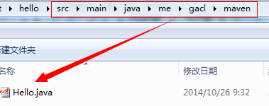
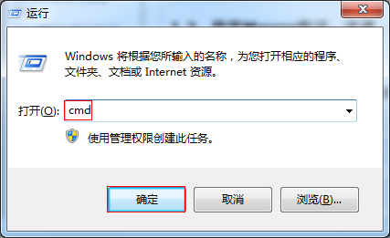
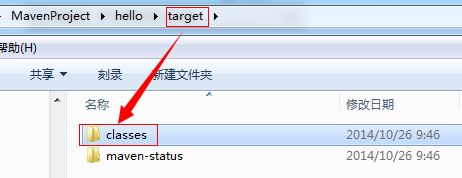

## 构建Maven项目

### 一、创建Maven项目
1、建立Hello项目

&nbsp;&nbsp;&nbsp;&nbsp;（1）首先建立Hello项目，同时建立Maven约定的目录结构和pom.xml文件

Hello

&nbsp;&nbsp;&nbsp;&nbsp;| -- src

&nbsp;&nbsp;&nbsp;&nbsp;| ----|----main

&nbsp;&nbsp;&nbsp;&nbsp;| ----|----|----java

&nbsp;&nbsp;&nbsp;&nbsp;| ----|----|----resources

&nbsp;&nbsp;&nbsp;&nbsp;| ----|----test

&nbsp;&nbsp;&nbsp;&nbsp;| ----|----|----java

&nbsp;&nbsp;&nbsp;&nbsp;| ----|----|----resources

&nbsp;&nbsp;&nbsp;&nbsp;| -- pom.xml


&nbsp;&nbsp;&nbsp;&nbsp;（2）编辑项目Hello根目录下的pom.xml,添加如下的代码：
```
              <project xmlns="http://maven.apache.org/POM/4.0.0" xmlns:xsi="http://www.w3.org/2001/XMLSchema-instance"
              xsi:schemaLocation="http://maven.apache.org/POM/4.0.0 http://maven.apache.org/xsd/maven-4.0.0.xsd">
                <modelVersion>4.0.0</modelVersion>
                <groupId>me.gacl.maven</groupId>
                <artifactId>Hello</artifactId>
                <version>0.0.1-SNAPSHOT</version>
                <name>Hello</name>

                  <!--添加依赖的jar包-->
                  <dependencies>
                      <!--项目要使用到junit的jar包，所以在这里添加junit的jar包的依赖-->
                      <dependency>
                          <groupId>junit</groupId>
                          <artifactId>junit</artifactId>
                          <version>4.9</version>
                          <scope>test</scope>
                      </dependency>        

                  </dependencies>
              </project>
```
&nbsp;&nbsp;&nbsp;&nbsp;（3）在src/main/java/me/gacl/maven目录下新建文件Hello.java



&nbsp;&nbsp;&nbsp;&nbsp;Hello.java文件的代码如下：
```
                package me.gacl.maven;
                public class Hello {                    
                    public String sayHello(String name){
                        return "Hello "+name+"!";
                    }
                }
```
&nbsp;&nbsp;&nbsp;&nbsp;（4）在/src/test/java/me/gacl/maven目录下新建测试文件HelloTest.java


&nbsp;&nbsp;&nbsp;&nbsp;HelloTest.java的代码如下：
```
            package me.gacl.maven;
            //导入junit的包
            import org.junit.Test;
            import static junit.framework.Assert.*;
            public class HelloTest {
                @Test
                public void testHello(){
                    Hello hello = new Hello();
                    String results = hello.sayHello("gacl");
                    assertEquals("Hello gacl!",results);        
                }
            }
```
2、使用Maven编译、清理、测试、打包项目
&nbsp;&nbsp;&nbsp;&nbsp;（1）使用Maven编译项目，编译项目的命令是：“mvn compile”

&nbsp;&nbsp;&nbsp;&nbsp;打开cmd命令行



&nbsp;&nbsp;&nbsp;&nbsp;进入Hello项目根目录执行“mvn compile”命令编译项目的java类


&nbsp;&nbsp;&nbsp;&nbsp;编译成功后，可以看到hello项目的根目录下多了一个【target】文件夹，这个文件夹就是编译成功之后Maven帮我们生成的文件夹，如下图所示：


&nbsp;&nbsp;&nbsp;&nbsp;打开【target】文件夹，可以看到里面有一个【classes】文件夹，如下图所示：



&nbsp;&nbsp;&nbsp;&nbsp;【classes】文件夹中存放的就是Maven编译好的java类，如下图所示：


### 二、构建Java项目
#### 1、创建Java Project

&nbsp;&nbsp;&nbsp;&nbsp;A:使用mvn archetype：generate命令，如下所示：
```
mvn archetype:generate -DroupId = com.mycompany.app
                       -DartifactId = myapp
                       -DarchetypeArtifactId = maven-archetype-quickstart
                       -DinteractiveMode=false
```
&nbsp;&nbsp;&nbsp;&nbsp;B：使用mvn archetype:create命令，如下所示：
```
mvn archetype:create -DgroupId = com.mycompany.app
                     -DartifactId = myapp
                     -DarchetypeArtifactId = maven-archetype-quickstart
                     -DinteractiveMode = false
```
&nbsp;&nbsp;&nbsp;&nbsp;<font color='red' font-weight='bold'>generate和create的区别：</font>generate创建项目耗时长，create创建项目耗时短。

&nbsp;&nbsp;&nbsp;&nbsp;使用mvn archetype:create命令创建项目的过程如下所示：


&nbsp;&nbsp;&nbsp;&nbsp;BUILD SUCCESS就表示项目构建成功，在当前用户目录下（即C:\Documents and Settings\Administrator）下构建了一个Java Project叫做myapp。

&nbsp;&nbsp;&nbsp;&nbsp;构建好的Java项目的目录结构如下：


&nbsp;&nbsp;&nbsp;&nbsp;Maven创建的是一个标准的Maven项目，不过目前Maven只是生成了src/main/java(存放项目的源代码)和src/test/java(存放测试源代码)这两个目录，但在实际项目中还会有配置文件，如log4j.properties,所以还需手动创建src/main/resources(存放项目开发中用到的配置文件，如存放log4j.properties等)和src/test/resources(存放测试时用到的配置文件)，如下图所示：


&nbsp;&nbsp;&nbsp;&nbsp;然后将创建好的myapp项目导入到eclipse中进行开发，如下图所示：


#### 2：项目中的POM.xml文件的说明

&nbsp;&nbsp;&nbsp;&nbsp;通过Maven构建的JavaProject，在项目的根目录下会存在一个pom.xml文件，进入myapp目录可以看到一个pom.xml文件，这个文件是Maven的核心，如下图所知：


&nbsp;&nbsp;&nbsp;&nbsp;A：pom的意思是：project object model;

&nbsp;&nbsp;&nbsp;&nbsp;B：pom.xml文件包含了项目的信息和项目的依赖等；

&nbsp;&nbsp;&nbsp;&nbsp;C：pom.xml文件是可以继承的，大型项目中，子模快的pom.xml一般都会继承于父模块的pom.xml

pom.xml文件的内容如下：
```
<project xmlns="http://maven.apache.org/POM/4.0.0" xmlns:xsi="http://www.w3.org/2001/XMLSchema-instance"
  xsi:schemaLocation="http://maven.apache.org/POM/4.0.0 http://maven.apache.org/xsd/maven-4.0.0.xsd">
  <modelVersion>4.0.0</modelVersion>

  <groupId>com.mycompany.app</groupId>
  <artifactId>myapp</artifactId>
  <version>1.0-SNAPSHOT</version>
  <packaging>jar</packaging>

  <name>myapp</name>
  <url>http://maven.apache.org</url>

  <properties>
    <project.build.sourceEncoding>UTF-8</project.build.sourceEncoding>
  </properties>

  <dependencies>
    <dependency>
      <groupId>junit</groupId>
      <artifactId>junit</artifactId>
      <version>3.8.1</version>
      <scope>test</scope>
    </dependency>
  </dependencies>
</project>
```

pom文件的详细解析：

> <font color='blue'><</font><font color='red'>project</font><font color='blue'>></font>&nbsp;&nbsp;&nbsp;&nbsp;pom文件的顶级节点

> <font color='blue'><</font><font color='red'>modelVersion</font><font color='blue'>></font>&nbsp;&nbsp;&nbsp;&nbsp;object model版本，对Maven2和Maven3来说，只能是4.0.0


> <font color='blue'><</font><font color='red'>groupId</font><font color='blue'>></font>&nbsp;&nbsp;&nbsp;&nbsp;项目创建组织的标识，一般是域名的倒写

> <font color='blue'><</font><font color='red'>artifactId</font><font color='blue'>></font>&nbsp;&nbsp;&nbsp;&nbsp;定义了项目所在组织的标识符下的唯一标识，一个组织下可以有多个项目

> <font color='blue'><</font><font color='red'>version</font><font color='blue'>></font>&nbsp;&nbsp;&nbsp;&nbsp;version当前项目的版本，SNAPSHOT，在开发中，表示快照版本

> <font color='blue'><</font><font color='red'>packaging</font><font color='blue'>></font>&nbsp;&nbsp;&nbsp;&nbsp;打包的方式：有jar、war、ear等

> <font color='blue'><</font><font color='red'>name</font><font color='blue'>></font>&nbsp;&nbsp;&nbsp;&nbsp;项目的名称
> <font color='blue'><</font><font color='red'>url</font><font color='blue'>></font>&nbsp;&nbsp;&nbsp;&nbsp;项目的地址

> <font color='blue'><</font><font color='red'>properties</font><font color='blue'>></font>&nbsp;&nbsp;&nbsp;&nbsp;属性配置

> <font color='blue'><</font><font color='red'>dependencies</font><font color='blue'>></font>&nbsp;&nbsp;&nbsp;&nbsp;构建项目依赖的jar


<font color='red' font-weight='bold'>有groupId、artifactId和version唯一的确定了一个项目坐标</font>


#### 3：使用Maven编译-测试-打包-安装项目
&nbsp;&nbsp;&nbsp;&nbsp;A：编译
> &nbsp;&nbsp;&nbsp;&nbsp;编译源程序，进入命令行，切换到myapp目录，执行命令：mvn clean compile,如下图所示：


&nbsp;&nbsp;&nbsp;&nbsp;编译成功，在myapp目录下多出一个target目录，target\classes里面存放的就是编译后的class文件，如下图所示：


&nbsp;&nbsp;&nbsp;&nbsp;B：测试
> &nbsp;&nbsp;&nbsp;&nbsp;进入命令行，切换到myapp目录，执行命令：mvn clean test,如下图所示：


&nbsp;&nbsp;&nbsp;&nbsp;测试成功，在myapp\target目录下会有一个test-classes目录，存放的就是测试代码的class文件，如下图所示：


&nbsp;&nbsp;&nbsp;&nbsp;C：打包
> &nbsp;&nbsp;&nbsp;&nbsp;进入命令行，切换到myapp目录，执行命令：mvn clean package,执行打包命令前，会先执行编译和测试命令，如下图所示：


&nbsp;&nbsp;&nbsp;&nbsp;构建成功后，会在target目录下生成myapp-1.0-SNAPSHOT.jar包，如下图所示：


&nbsp;&nbsp;&nbsp;&nbsp;D：安装

&nbsp;&nbsp;&nbsp;&nbsp;进入命令行，切换到my-app目录，执行命令，mvn clean install，执行安装命令前，会先执行编译、测试、打包命令，如下图所示：


&nbsp;&nbsp;&nbsp;&nbsp;构建成功，就会将项目的jar包安装到本地仓库，如下图所示：


&nbsp;&nbsp;&nbsp;&nbsp;E：运行jar包

&nbsp;&nbsp;&nbsp;&nbsp;进入命令行，切换到myapp目录，执行命令：java - cp target\myapp-1.0-SNAPSHOT.jar com.mycompany.app.App,如下图所示:


### 三：构建JavaWeb项目
#### 1、创建JavaWeb项目
&nbsp;&nbsp;&nbsp;&nbsp;A：使用maven archetype:generate命令。如下图所示：
```
              mvn archetype:generate -DgroupId = com.mycompany.app
                                     -DartifactId = my-WebApp
                                     -DarchetypeArtifactId = maven-archetype-quickstart
                                     -DinteractiveMode = false
```

&nbsp;&nbsp;&nbsp;&nbsp;使用“mvn archetype:generate”命令创建一个javaWeb项目的过程如下图所示:


&nbsp;&nbsp;&nbsp;&nbsp;使用“mvn archetype:generate”命令创建一个javaWeb项目的时间非常长，要40多秒，有时甚至会更久。

&nbsp;&nbsp;&nbsp;&nbsp;B：使用mvn archetype:create命令，如下所示：
```
          mvn archetype:create -DgroupId = com.mycompany.app
                               -DartifactId = my-WebApp
                               -DarchetypeArtifactId = maven-archetype-quickstart
                               -DinteractiveMode = false
```

&nbsp;&nbsp;&nbsp;&nbsp;使用“mvn archetype:create”命令创建一个javaWeb项目的过程如下图所示：


&nbsp;&nbsp;&nbsp;&nbsp;使用"mvn archetype:create"命令创建一个javaWeb的时间非常快，几秒就可以了。

&nbsp;&nbsp;&nbsp;&nbsp;创建好的JavaWeb项目的目录结构如下：


&nbsp;&nbsp;&nbsp;&nbsp;创建好的javaWeb项目中目前只有src/main/resources目录，因此还需要手动添加src/main/java、src/test/java、src/test/resources，如下图所示：


&nbsp;&nbsp;&nbsp;&nbsp;接着我们将创建好的javaWeb导入Eclipse中进行开发了，如下图所示：


#### 2、使用Maven打包发布Web项目

&nbsp;&nbsp;&nbsp;&nbsp;Maven帮我们创建的JavaWeb项目是一个空的项目，只有一个index.jsp页面，只有一个index.jsp页面，我们使用Maven将Web项目打包发布运行。

&nbsp;&nbsp;&nbsp;&nbsp;在命令行切换到myWebApp目录，执行：mvn package，构建成功后，myWebApp目录下多了一个target目录，在这个目录下会打包成myWebApp.war，把这个war包拷贝到Tomcat的发布目录下就可以运行了。如下图所示：


&nbsp;&nbsp;&nbsp;&nbsp;打包成功，在myWebApp\target目录下生成了一个myWebApp.war文件，如下图所示：


&nbsp;&nbsp;&nbsp;&nbsp;将myWebApp.war放到tomcat服务器中运行，如下图所示：


&nbsp;&nbsp;&nbsp;&nbsp;运行效果如下：


&nbsp;&nbsp;&nbsp;&nbsp;除了使用Tomcat服务器运行Web项目之外，我们还可以在Web项目中集成jetty发布运行，首先在pom.xml文件中<font color='red' font-weight='bold'>配置Jetty</font>插件，如下：
```
<project xmlns="http://maven.apache.org/POM/4.0.0" xmlns:xsi="http://www.w3.org/2001/XMLSchema-instance"
  xsi:schemaLocation="http://maven.apache.org/POM/4.0.0 http://maven.apache.org/maven-v4_0_0.xsd">
  <modelVersion>4.0.0</modelVersion>
  <groupId>com.mycompany.app</groupId>
  <artifactId>myWebApp</artifactId>
  <packaging>war</packaging>
  <version>1.0-SNAPSHOT</version>
  <name>myWebApp Maven Webapp</name>
  <url>http://maven.apache.org</url>
  <dependencies>
    <dependency>
      <groupId>junit</groupId>
      <artifactId>junit</artifactId>
      <version>3.8.1</version>
      <scope>test</scope>
    </dependency>
  </dependencies>
  <build>
    <finalName>myWebApp</finalName>
     <pluginManagement>
        <!--配置Jetty-->
          <plugins>
            <plugin>
             <groupId>org.mortbay.jetty</groupId>   
             <artifactId>maven-jetty-plugin</artifactId>
            </plugin>
          </plugins>
    </pluginManagement>
  </build>
</project>
```

&nbsp;&nbsp;&nbsp;&nbsp;打开命令行窗口，切换到myWebApp目录，然后执行：<font color='red' font-weight='bold'>mvn jetty:run</font>启动jetty服务器，如下图所示：


&nbsp;&nbsp;&nbsp;&nbsp;接着就可以在8080端口上访问应用了。如下图所示：


#### 3、Maven创建项目的命令说明

mvn archetype:create或者mvn archetype:generate   固定写法（创建maven项目）

- -DgroupId&nbsp;&nbsp;&nbsp;&nbsp;    组织标识（包名）
- -DartifactId&nbsp;&nbsp;&nbsp;&nbsp;  项目名称
- -DarchetypeArtifactId&nbsp;&nbsp;&nbsp;&nbsp;  指定ArchetypeId,maven-archetype-quickstart,创建一个Java Project：maven-archetype-webapp，创建一个web project
- -DinteractiveMode&nbsp;&nbsp;&nbsp;&nbsp;  是否使用交互模式
- archetype是mvn内置的一个插件，create任务可以创建一个java项目骨架，DgroupId是软件包的名称，DartifactId是项目名，DarchetypeArtifactId是可用的mvn项目骨架，
<font color='yellow' font-weight='bold'>目前可以使用的骨架有：</font>

* maven-archetype-archetype
* maven-archetype-j2ee-simple
* maven-archetype-mojo
* maven-archetype=portlet
* maven-archetype-profiles(currently under development)
* maven-archetype-quickstart
* maven-archetype-simple(currently under development)
* maven-archetype-site
* maven-archetype-site-simple
* maven-archetype-webapp

&nbsp;&nbsp;&nbsp;&nbsp;每一个骨架都会建相应的目录结构和一些通用的文件，最常用的是<font color='red'>maven-archetype-quickstart和maven-archetype-webapp</font>骨架。maven-archetype-quickstart骨架是用来创建一个java project，而maven-archetype-webapp骨架则是用来创建一个javaWeb project。
