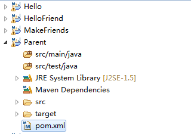
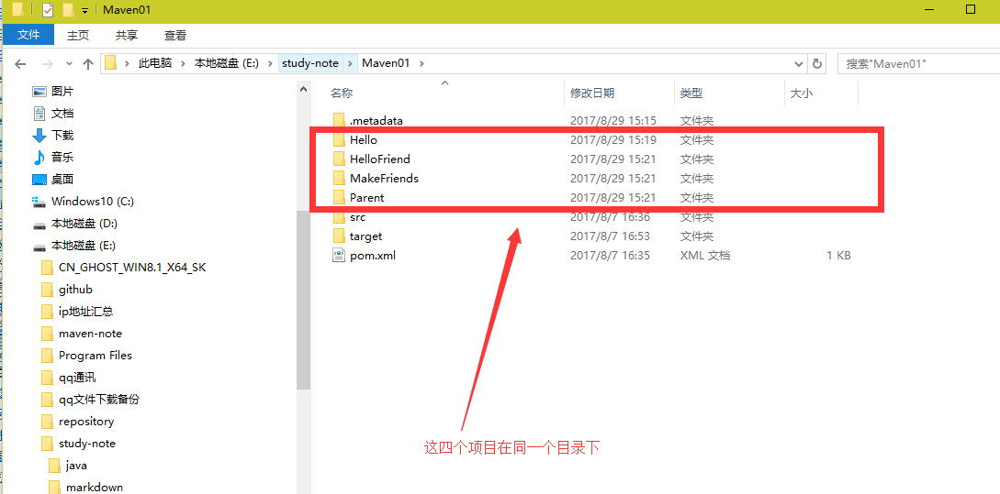
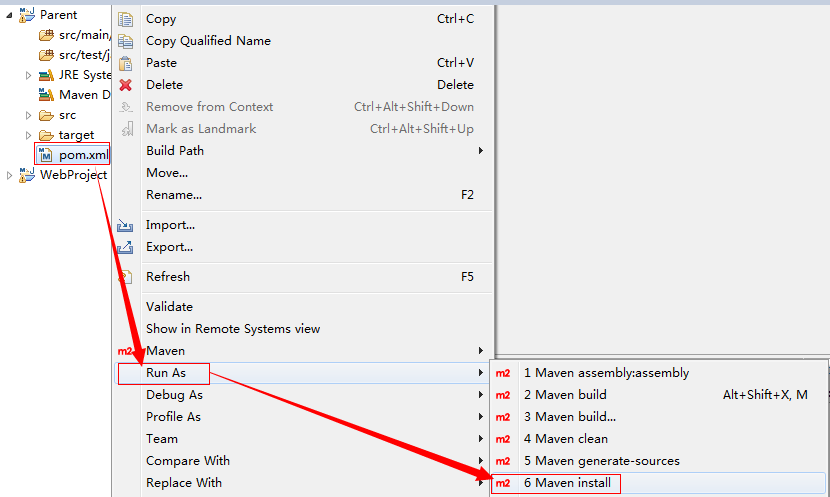
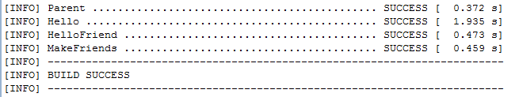

#### 一：聚合
&nbsp;&nbsp;&nbsp;&nbsp;&nbsp;&nbsp;&nbsp;&nbsp;若我们想要一次构建多个项目模块，那我们就需要对多个项目模块进行聚合。
> 1、聚合配置

```
                <modules>
                      <module>模块一</module>
                      <module>模块二</module>
                      <module>模块三</module>
                </modules>
```
> <font color="red">示例：</font>

> &nbsp;&nbsp;&nbsp;&nbsp;&nbsp;&nbsp;&nbsp;&nbsp;如：对项目的Hello、HelloFriend、MakeFriends这三个模块进行聚合。

```
                <modules>
                      <module>../Hello</module>
                      <module>../HelloFriend</module>
                      <module>../MakeFriends</module>
                </modules>
```
<font color="red">其中module的路径为相对路径。</font>

#### 二：继承
&nbsp;&nbsp;&nbsp;&nbsp;&nbsp;&nbsp;&nbsp;&nbsp;继承为了消除重复，我们把很多相同的配置提取出来，例如：groupId，version等。
> 1、继承配置代码

```
          <parent>
                <groupId>me.gacl.maven</groupId>
                <artifactId>ParentProject</artifactId>
                <version>0.0.1-SNAPSHOT</version>

                <relativePath>../ParentProject/pom.xml</relativePath>
          </parent>
```
> 2、继承代码中定义属性

&nbsp;&nbsp;&nbsp;&nbsp;&nbsp;&nbsp;&nbsp;&nbsp;继承代码过程中，可以定义属性，例如：

```
          <properties>
                  <project.build.sourceEncoding>UTF-8</project.build.ssourceEncoding>
                  <junit.version>4.9</junit.version>
                  <maven.version>0.0.0.1-SNAPSHOT</maven.version>
          </properties>
```

&nbsp;&nbsp;&nbsp;&nbsp;&nbsp;&nbsp;&nbsp;&nbsp;访问属性的方式为${junit.version},例如：
```
          <dependency>
                  <groupId>junit</groupId>
                  <artifactId>junit</artifactId>
                  <version>${junit.version}</version>
                  <scope>test</scope>
          </dependency>
```

> 3、父模块用dependencyManagement进行管理

```
          <dependencyManagement>
                <dependencies>
                    <dependency>
                        <groupId>junit</groupId>
                        <artifactId>junit</artifactId>
                        <version>${junit.version}</version>
                        <scope>test</scope>
                    </dependency>

                    <dependency>
                        <groupId>cn.itcast.maven</groupId>
                        <artifactId>HelloFriend</artifactId>
                        <version>${maven.version}</version>
                        <type>jar</type>
                        <scope>compile</scope>
                    </dependency>
                </dependencies>
          </dependencyManagement>
```
&nbsp;&nbsp;&nbsp;&nbsp;&nbsp;&nbsp;&nbsp;&nbsp;这样的好处是子模块可以有选择性的继承，而不需要全部继承。
#### 三：聚合与继承的关系
&nbsp;&nbsp;&nbsp;&nbsp;&nbsp;&nbsp;&nbsp;&nbsp;聚合主要是为了快速构建项目，继承主要为了消除重复。
#### 四：聚合与继承实战演练
&nbsp;&nbsp;&nbsp;&nbsp;&nbsp;&nbsp;&nbsp;&nbsp;创建四个Maven下个内幕，如下图所示：

&nbsp;&nbsp;&nbsp;&nbsp;&nbsp;&nbsp;&nbsp;&nbsp;

&nbsp;&nbsp;&nbsp;&nbsp;&nbsp;&nbsp;&nbsp;&nbsp;这四个项目放在同一个目录下，方便后面进行聚合和继承。

&nbsp;&nbsp;&nbsp;&nbsp;&nbsp;&nbsp;&nbsp;&nbsp; 

&nbsp;&nbsp;&nbsp;&nbsp;&nbsp;&nbsp;&nbsp;&nbsp;Parent项目是其他三个项目的父项目，主要是用来配置一些公共的配置，其他三个项目在通过继承的方式拥有Parent项目的Pom.xml，添加对项目的Hello,HelloFriend,MakeFriends这三个模块进行聚合以及jar打包依赖，pom.xml的配置信息如下：

&nbsp;&nbsp;&nbsp;&nbsp;&nbsp;&nbsp;&nbsp;&nbsp;<font color="red">Parent项目的pom.xml配置：</font>

```
<project xmlns="http://maven.apache.org/POM/4.0.0"
         xmlns:xsi="http://www.w3.org/2001/XMLSchema-instance"
         xsi:schemaLocation="http://maven.apache.org/POM/4.0.0
                             http://maven.apache.org/xsd/maven-4.0.0.xsd">
    <modelVersion>4.0.0</modelVersion>

    <groupId>me.gacl.maven</groupId>
    <artifactId>Parent</artifactId>
    <version>0.0.1-SNAPSHOT</version>
    <packaging>pom</packaging>

    <name>Parent</name>
    <url>http://maven.apache.org</url>

    <!-- 对项目的Hello、HelloFriend、MakeFriends这三个模块进行聚合 -->
    <modules>
        <module>../Hello</module>
        <module>../HelloFriend</module>
        <module>../MakeFriends</module>
    </modules>

    <!-- 定义属性 -->
    <properties>
        <project.build.sourceEncoding>UTF-8</project.build.sourceEncoding>
        <junit.version>4.9</junit.version>
        <maven.version>0.0.1-SNAPSHOT</maven.version>
    </properties>

    <!-- 用dependencyManagement进行jar包依赖管理 -->
    <dependencyManagement>
        <!-- 配置jar包依赖 -->
        <dependencies>
            <dependency>
                <groupId>junit</groupId>
                <artifactId>junit</artifactId>
                <!-- 访问junit.version属性 -->
                <version>${junit.version}</version>
                <scope>test</scope>
            </dependency>
            <dependency>
                <groupId>me.gacl.maven</groupId>
                <artifactId>Hello</artifactId>
                <!-- 访问maven.version属性 -->
                <version>${maven.version}</version>
                <scope>compile</scope>
            </dependency>
            <dependency>
                <groupId>me.gacl.maven</groupId>
                <artifactId>HelloFriend</artifactId>
                <!-- 访问maven.version属性 -->
                <version>${maven.version}</version>
            </dependency>
        </dependencies>
    </dependencyManagement>
</project>
```
&nbsp;&nbsp;&nbsp;&nbsp;&nbsp;&nbsp;&nbsp;&nbsp;<font color="red">在Hello项目的pom.xml中继承Parent项目的pom.xml配置：
```
<project xmlns="http://maven.apache.org/POM/4.0.0"
         xmlns:xsi="http://www.w3.org/2001/XMLSchema-instance"
         xsi:schemaLocation="http://maven.apache.org/POM/4.0.0
                             http://maven.apache.org/xsd/maven-4.0.0.xsd">

  <modelVersion>4.0.0</modelVersion>
  <artifactId>Hello</artifactId>

      <!-- 继承Parent项目中的pom.xml配置 -->
       <parent>  
          <groupId>me.gacl.maven</groupId>
         <artifactId>Parent</artifactId>
          <version>0.0.1-SNAPSHOT</version>
          <!-- 使用相对路径 -->
        <relativePath>../Parent/pom.xml</relativePath>  
    </parent>

    <dependencies>
        <dependency>
            <groupId>junit</groupId>
            <artifactId>junit</artifactId>
        </dependency>
    </dependencies>
</project>
```
&nbsp;&nbsp;&nbsp;&nbsp;&nbsp;&nbsp;&nbsp;&nbsp;<font color="red">在HelloFriend项目的pom.xml中继承Parent项目的pom.xml配置：
```
<project xmlns="http://maven.apache.org/POM/4.0.0"
         xmlns:xsi="http://www.w3.org/2001/XMLSchema-instance"
         xsi:schemaLocation="http://maven.apache.org/POM/4.0.0
                             http://maven.apache.org/xsd/maven-4.0.0.xsd">
    <modelVersion>4.0.0</modelVersion>
    <artifactId>HelloFriend</artifactId>
    <name>HelloFriend</name>

    <!-- 继承Parent项目中的pom.xml配置 -->
    <parent>
        <groupId>me.gacl.maven</groupId>
        <artifactId>Parent</artifactId>
        <version>0.0.1-SNAPSHOT</version>
        <relativePath>../Parent/pom.xml</relativePath>
    </parent>
    <dependencies>
        <dependency>
            <!-- Parent项目的pom.xml文件配置中已经指明了要使用的Junit的版本号，因此在这里添加junit的依赖时，
            可以不指明<version></version>和<scope>test</scope>，会直接从Parent项目的pom.xml继承 -->
            <groupId>junit</groupId>
            <artifactId>junit</artifactId>
        </dependency>
        <!-- HelloFriend项目中使用到了Hello项目中的类，因此需要添加对Hello.jar的依赖
        Hello.jar的<version>和<scope>也已经在Parent项目的pom.xml文件配置中已经指明了
        因此这里也可以省略不写了
        -->
        <dependency>
            <groupId>me.gacl.maven</groupId>
            <artifactId>Hello</artifactId>
        </dependency>
    </dependencies>
</project>
```
&nbsp;&nbsp;&nbsp;&nbsp;&nbsp;&nbsp;&nbsp;&nbsp;<font color="red">在MakeFriends项目的pom.xml中继承Parent项目的pom.xml配置：
```
<project xmlns="http://maven.apache.org/POM/4.0.0"
         xmlns:xsi="http://www.w3.org/2001/XMLSchema-instance"
         xsi:schemaLocation="http://maven.apache.org/POM/4.0.0
                             http://maven.apache.org/xsd/maven-4.0.0.xsd">
    <modelVersion>4.0.0</modelVersion>
    <artifactId>MakeFriends</artifactId>
    <!-- 继承Parent项目中的pom.xml配置 -->
    <parent>
        <groupId>me.gacl.maven</groupId>
        <artifactId>Parent</artifactId>
        <version>0.0.1-SNAPSHOT</version>
        <relativePath>../Parent/pom.xml</relativePath>
    </parent>
    <dependencies>
        <dependency>
        <!-- Parent项目的pom.xml文件配置中已经指明了要使用的Junit的版本号，因此在这里添加junit的依赖时，
            可以不指明<version></version>和<scope>test</scope>，会直接从Parent项目的pom.xml继承 -->
            <groupId>junit</groupId>
            <artifactId>junit</artifactId>
        </dependency>
        <dependency>
        <!-- MakeFriends项目中使用到了HelloFriend项目中的类，因此需要添加对HelloFriend.jar的依赖
        HelloFriend.jar的<version>和<scope>也已经在Parent项目的pom.xml文件配置中已经指明了
        因此这里也可以省略不写了
        -->
            <groupId>me.gacl.maven</groupId>
            <artifactId>HelloFriend</artifactId>
        </dependency>
    </dependencies>
</project>
```

&nbsp;&nbsp;&nbsp;&nbsp;&nbsp;&nbsp;&nbsp;&nbsp;以上的四个项目的pom.xml经过这样的配置之后，就完成了在Parent项目中聚合Hello、HelloFriend、MakeFriends这三个子项目(子模块)，而Hello、HelloFriend、MakeFriends这三个子项目(子模块)也继承了Parent项目中的公共配置，这样就可以使用Maven一次性构建所有的项目了，如下图所示：

&nbsp;&nbsp;&nbsp;&nbsp;&nbsp;&nbsp;&nbsp;&nbsp;

&nbsp;&nbsp;&nbsp;&nbsp;&nbsp;&nbsp;&nbsp;&nbsp;选中Parent项目的pom.xml文件→【Run As】→【Maven install】，这样Maven就会一次性同时构建Parent、Hello、HelloFriend、MakeFriends这四个项目，如下图所示：

&nbsp;&nbsp;&nbsp;&nbsp;&nbsp;&nbsp;&nbsp;&nbsp;
