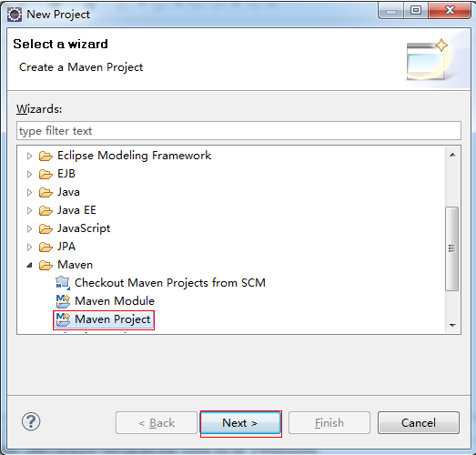
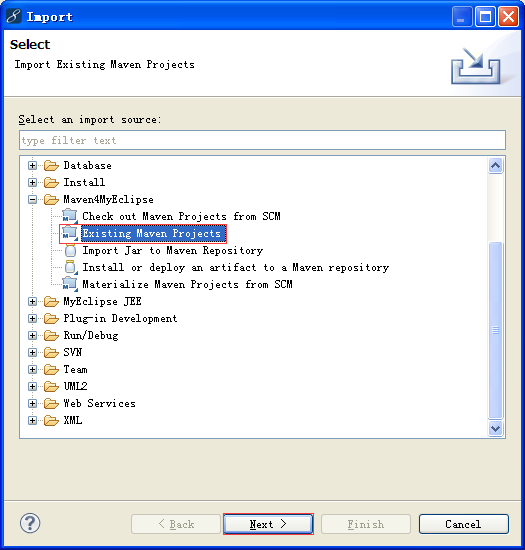

### 一：创建Web项目
> 1、选择建立Maven Project
> >　选择File——>New——>Project，如下图所示：


> > 在New窗口i中选择 Maven ——>Maven Project，点击Next如下图所示：



> 2、选择项目路径
> > 根据项目的实际情况选择项目的存放目录，也可以选择【Use default Workspace location】默认工作空间。如下图所示：


> 3、选择项目类型
> > 在ArtifactId中选择maven-archetype-webapp，如下图所示：


> 4、输入Group ID和Artifact ID以及Package
> >Group ID：一般写大项目名称。
> >Artifact ID：子项目的名称。如：Spring的web包，Group ID：org.springframework,ArtifactId:spring-web
> >Package：默认给你建一个包，不写也可以。如下图所示：


> 5、项目建立好后的文件结构
> >刚建立好后的文件结构如下图所示：


### 二：将Web项目自动部署到tomcat服务器
#### &nbsp;&nbsp;&nbsp;&nbsp;&nbsp;&nbsp;&nbsp;&nbsp; 1、在pom.xml文件中配置tomcat服务器
> 配置web项目的pom.xml文件，配置如下：

```
  <project xmlns="http://maven.apache.org/POM/4.0.0"                                       
           xmlns:xsi="http://www.w3.org/2001/XMLSchema-instance"    
           xsi:schemaLocation="http://maven.apache.org/POM/4.0.0
                               http://maven.apache.org/maven-v4_0_0.xsd">
        <modelVersion>4.0.0</modelVersion>
        <groupId>me.gacl.maven</groupId>
        <artifactId>WebProject</artifactId>
        <packaging>war</packaging>
        <version>0.0.1-SNAPSHOT</version>
        <name>WebProject Maven Webapp</name>
        <url>http://maven.apache.org</url>
        <dependencies>
          <dependency>
            <groupId>junit</groupId>
            <artifactId>junit</artifactId>
            <version>3.8.1</version>
            <scope>test</scope>
          </dependency>
        </dependencies>

        <!-- 将Web项目自动部署到tomcat服务器的相关 配置信息-->
        <build>
            <!-- 将WebProject项目打包成WebProject.war自动部署到tomcat服务器的webapps目录下面 -->
          <finalName>WebProject</finalName>
          <plugins>
                <plugin>
                    <groupId>org.codehaus.cargo</groupId>
                    <artifactId>cargo-maven2-plugin</artifactId>
                      <version>1.2.3</version>
                      <configuration>
                          <container>
                                <!-- 指明使用的tomcat服务器版本 -->
                              <containerId>tomcat7x</containerId>
                              <!--指明tomcat服务器的安装目录 -->
                              <home>D:/apache-tomcat-7.0.53</home>
                          </container>
                          <configuration>
                              <type>existing</type>
                              <!--指明tomcat服务器的安装目录 -->
                              <home>D:/apache-tomcat-7.0.53</home>
                          </configuration>
                      </configuration>
                      <executions>  
                        <execution>  
                            <id>cargo-run</id>  
                            <phase>install</phase>  
                            <goals>  
                                <goal>run</goal>  
                            </goals>  
                        </execution>  
                    </executions>
                </plugin>
            </plugins>
        </build>
  </project>
```
#### &nbsp;&nbsp;&nbsp;&nbsp;&nbsp;&nbsp;&nbsp;&nbsp; 2、将Web项目发布到tomcat服务器的webapps目录
> 选中web项目（或者选中web项目的pom.xml文件）——>Run As——>Maven install，如下图所示：


> 执行Maven install命令之后，就可以将webProject项目打包成WebProject.war包发布到tomcat服务器的webapps目录下，如下图所示：


> 测试部署好的Web项目，如下图所示：


> 浏览器正常输入了index.jsp页面中的内容，这说明我们的部署成功了。这就是Eclipse中使用Maven将Web项目自动部署到tomcat服务器的过程。

### 三、使用Maven构建多模块项目
> &nbsp;&nbsp;&nbsp;&nbsp;&nbsp;&nbsp;&nbsp;&nbsp;在平时的JavaWeb项目开发中为了便于后期的维护，我们一般会进行分层开发最常见的就是分为domain（域模型层）、dao（数据库访问层）、service（业务逻辑层）、web（表现层），这样分层之后，各个层之间的职责会比较明确，后期维护起来也相对比较容易，

> 项目结构如下：


#### 1、创建system-parent项目
> &nbsp;&nbsp;&nbsp;&nbsp;&nbsp;&nbsp;&nbsp;&nbsp;创建system-parent，用来给各个子模块继承。

> &nbsp;&nbsp;&nbsp;&nbsp;&nbsp;&nbsp;&nbsp;&nbsp;进入命令行，输入以下命令：

```
mvn archetype:create -DgroupId=me.gacl
                     -DartifactId=system-parent
                     -DarchetypeArtifactId=maven-archetype-quickstart
                     -DinteractiveMode=false
```

> 如下图所示：


> 命令执行完成之后可以看到在当前目录(C:\Documents and Settings\Administrator)生成了system-parent目录，里面有一个src目录和一个pom.xml文件，如下图所示：


```
将src文件夹删除，然后修改pom.xml文件，将<packaging>jar</packaging>修改为<packaging>pom</packaging>，pom表示它是一个被继承的模块，修改后的内容如下：
```

```
<project xmlns="http://maven.apache.org/POM/4.0.0"       
         xmlns:xsi="http://www.w3.org/2001/XMLSchema-instance"
         xsi:schemaLocation="http://maven.apache.org/POM/4.0.0       
                              http://maven.apache.org/xsd/maven-4.0.0.xsd">
        <modelVersion>4.0.0</modelVersion>

        <groupId>me.gacl</groupId>
        <artifactId>system-parent</artifactId>
        <version>1.0-SNAPSHOT</version>
        <packaging>pom</packaging>

        <name>system-parent</name>
        <url>http://maven.apache.org</url>

        <properties>
          <project.build.sourceEncoding>UTF-8</project.build.sourceEncoding>
        </properties>

        <dependencies>
          <dependency>
            <groupId>junit</groupId>
            <artifactId>junit</artifactId>
            <version>3.8.1</version>
            <scope>test</scope>
          </dependency>
        </dependencies>
</project>
```
#### 2、创建system-domain模块
> 在命令行进入创建好的system-parent目录，然后执行下列命令：

```
mvn archetype:create -DgroupId=me.gacl
                     -DartifactId=system-domain
                     -DarchetypeArtifactId=maven-archetype-quickstart
                     -DinteractiveMode=false
```

> 如下图所示：


> 命令执行完成后可以看到system-parent目录中生成了system-domain,里面包含src目录和pom.xml文件。如下图所示：


> 同时在system-parent目录中的pom.xml文件自动添加了如下内容：


> 这时，system-parent中的pom.xml文件的内容如下所示：

```
<?xml version="1.0" encoding="UTF-8"?>
<project xmlns="http://maven.apache.org/POM/4.0.0"  
         xmlns:xsi="http://www.w3.org/2001/XMLSchema-instance" xsi:schemaLocation="http://maven.apache.org/POM/4.0.0  
                             http://maven.apache.org/xsd/maven-4.0.0.xsd">
  <modelVersion>4.0.0</modelVersion>

  <groupId>me.gacl</groupId>
  <artifactId>system-parent</artifactId>
  <version>1.0-SNAPSHOT</version>
  <packaging>pom</packaging>

  <name>system-parent</name>
  <url>http://maven.apache.org</url>

  <properties>
    <project.build.sourceEncoding>UTF-8</project.build.sourceEncoding>
  </properties>

  <dependencies>
    <dependency>
      <groupId>junit</groupId>
      <artifactId>junit</artifactId>
      <version>3.8.1</version>
      <scope>test</scope>
    </dependency>
  </dependencies>
  <modules>
    <module>system-domain</module>
  </modules>
</project>
```

> 修改system-domain目录中的pom.xml文件,如下所示：


> <font color="red">因为groupId和version会继承system-parent中的groupId和version，packaging设置打包方式为jar</font>

#### 3、创建system-dao模块
> 在命令行进入创建好的system-parent目录，然后执行下列命令：

```
mvn archetype:create -DgroupId=me.gacl
                     -DartifactId=system-dao
                     -DarchetypeArtifactId=maven-archetype-quickstart
                     -DinteractiveMode=false
```

> 如下图所示：


> 命令执行完成之后可以看到system-parent目录中生成了system-dao，里面包含了src目录和pom.xml文件。如下图所示：


> 同时，在system-parent的pom.xml文件中自动变成了如下的内容：


> 修改system-dao目录中的pom.xml文件，如下图所示：


#### 4、创建system-service模块
> 在命令行进入创建好的system-parent目录，然后执行下列命令：

```
mvn archetype:create -DgroupId=me.gacl
                     -DartifactId=system-service    
                     -DarchetypeArtifactId=maven-archetype-quickstart
                     -DinteractiveMode=false
```

> 如下图所示：


> 命令执行完成后的效果如下所示：


> 同时，在system-parent目录中的pom文件自动变成如下所示：


> 修改service中的pom文件

```
把<groupId>me.gacl</groupId>和<version>1.0-SNAPSHOT</version>去掉，加上<packaging>jar</packaging>，因为groupId和version会继承system-parent中的groupId和version，packaging设置打包方式为jar，同时添加对system-dao模块的依赖，system-service依赖system-dao和system-domain，但是我们只需添加system-dao的依赖即可，因为system-dao已经依赖了system-domain。修改后的内容如下：
```


#### 5、创建system-web模块
> 在命令行进入创建好的system-parent目录，然后执行下列命令：

```
mvn archetype:create -DgroupId=me.gacl
                     -DartifactId=system-web
                     -DarchetypeArtifactId=maven-archetype-webapp
                     -DinteractiveMode=false
```


> 命令执行完后的效果如下图所示：


> 同时，在system-parent目录中的pom.xml文件自动变成如下内容：

```
<?xml version="1.0" encoding="UTF-8"?>
<project xmlns="http://maven.apache.org/POM/4.0.0"
         xmlns:xsi="http://www.w3.org/2001/XMLSchema-instance"
         xsi:schemaLocation="http://maven.apache.org/POM/4.0.0
                             http://maven.apache.org/xsd/maven-4.0.0.xsd">
  <modelVersion>4.0.0</modelVersion>

  <groupId>me.gacl</groupId>
  <artifactId>system-parent</artifactId>
  <version>1.0-SNAPSHOT</version>
  <packaging>pom</packaging>

  <name>system-parent</name>
  <url>http://maven.apache.org</url>

  <properties>
    <project.build.sourceEncoding>UTF-8</project.build.sourceEncoding>
  </properties>

  <dependencies>
    <dependency>
      <groupId>junit</groupId>
      <artifactId>junit</artifactId>
      <version>3.8.1</version>
      <scope>test</scope>
    </dependency>
  </dependencies>
  <modules>
    <module>system-domain</module>
    <module>system-dao</module>
    <module>system-service</module>
    <module>system-web</module>
  </modules>
</project>
```

> 修改system-web目录中的pom.xml文件


```
把<groupId>me.gacl</groupId>和<version>1.0-SNAPSHOT</version>去掉，
因为groupId和version会继承system-parent中的groupId和version，
同时添加对system-service模块的依赖
```
<font color="red">注意：</font>

> &nbsp;&nbsp;&nbsp;&nbsp;&nbsp;&nbsp;&nbsp;&nbsp;<font color="red">web项目的打包方式是war。</font>

#### 6、编译运行项目
> 经过上面的五个步骤，相关的模块全部创建完成，怎么运行起来呢。由于最终运行的是system-web模块，所以我们对该模块添加jetty支持，方便测试运行。修改system-web项目的pom.xml如下：

```
<?xml version="1.0"?>
<project xsi:schemaLocation="http://maven.apache.org/POM/4.0.0
                             http://maven.apache.org/xsd/maven-4.0.0.xsd"
         xmlns="http://maven.apache.org/POM/4.0.0"
         xmlns:xsi="http://www.w3.org/2001/XMLSchema-instance">
  <modelVersion>4.0.0</modelVersion>
  <parent>
    <groupId>me.gacl</groupId>
    <artifactId>system-parent</artifactId>
    <version>1.0-SNAPSHOT</version>
  </parent>

  <artifactId>system-web</artifactId>
  <packaging>war</packaging>

  <name>system-web Maven Webapp</name>
  <url>http://maven.apache.org</url>
  <dependencies>
    <!--
    system-web依赖system-service
    -->
     <dependency>
      <groupId>me.gacl</groupId>
      <artifactId>system-service</artifactId>
      <version>${project.version}</version>
    </dependency>
  </dependencies>
  <build>
    <finalName>system-web</finalName>
    <plugins>
        <!--配置Jetty插件-->
        <plugin>
            <groupId>org.mortbay.jetty</groupId>
            <artifactId>maven-jetty-plugin</artifactId>
        </plugin>
    </plugins>
  </build>
</project>
```
> 在命令进入system-parent目录，然后执行下列命令：

```
mvn clean install
```

> 如下图所示：


> 创建成功的标志：


> 命令执行完后，在system-web目录下多出了target目录，里面有了system-web.war，如下图所示：


> 命令行进入sytem-web目录，执行如下命令，启动jetty

```
mvn jetty:run
```

> 如下图所示：


> 如下图所示表示jetty成功运行：


> 启动jetty服务器后，访问http://localhost:8080/system-web/ 运行结果如下图所示：


#### 7、导入Eclipse中开发
> 操作步骤如下所示：





